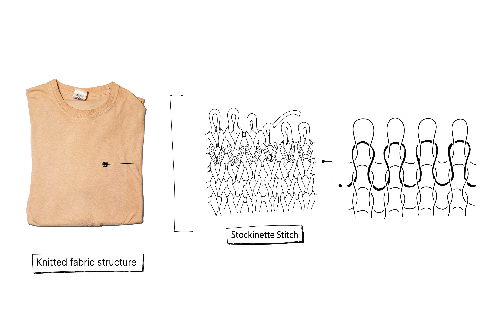
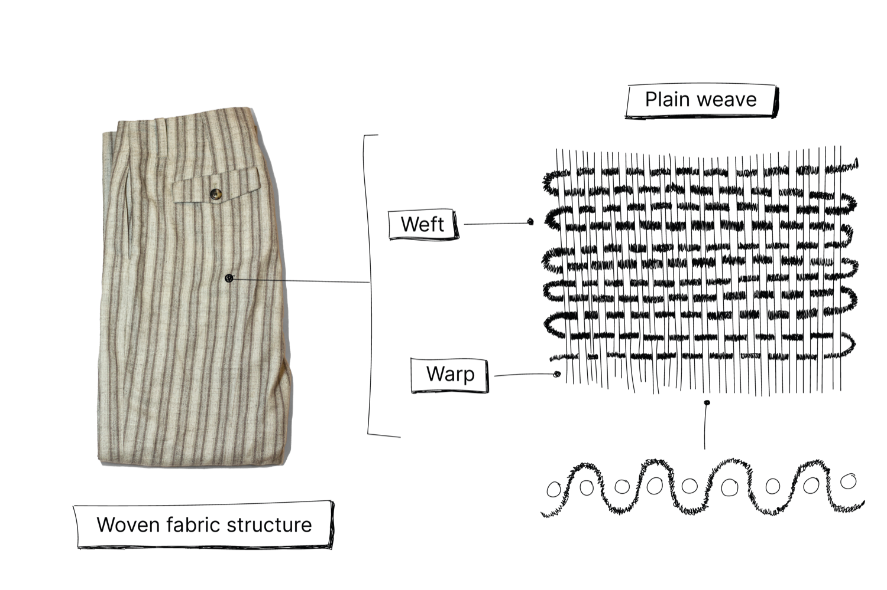
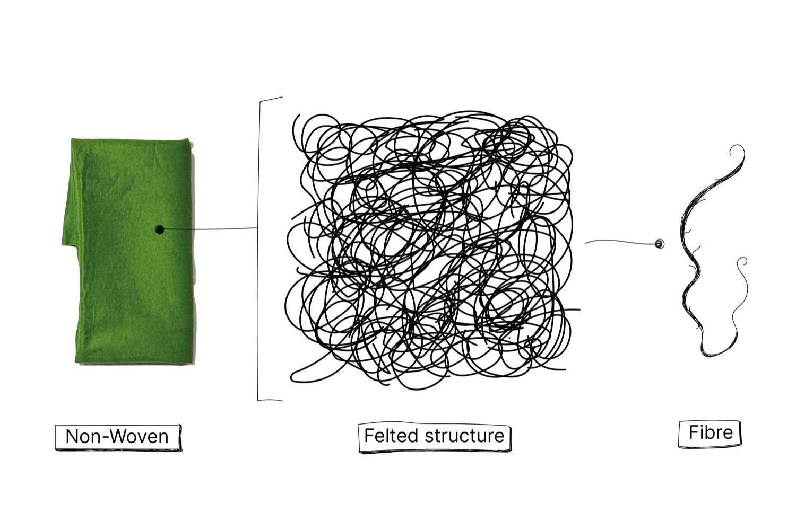
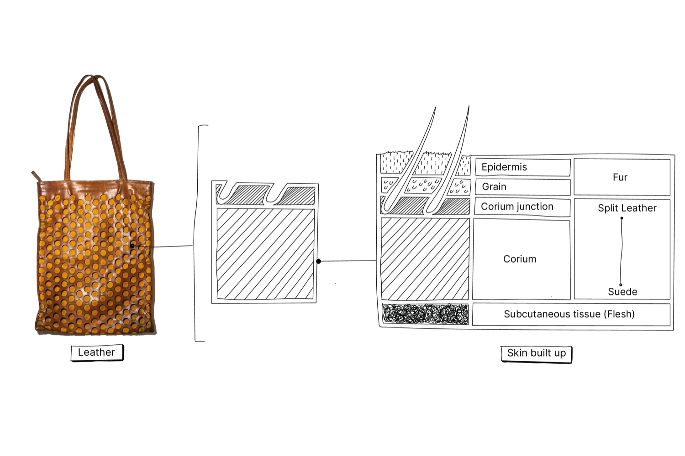

#  Fabrics overview
There are different ways to spin the fibres into yarn, but we will not go too deep into that, although this does affect how the fabric will turn out. Fabrics can fall under three main categories: Knitted, Woven or Non- woven. Leather and fur are also considered fabrics.

|Type of fabric| Often used in:|
|----|----|
|Knitted| T-shirts, Socks, Jumpers, Hoodies, Leggings and Underwear, Sportswear, Hosiery|
|Woven| Pants, Jeans, Blouse, Shirt|
|Non-woven| Rain coats and Felted Jackets|
|Leather | Jacket,  Bags, Pants and Skirts|
|Fur| Coats, Scarfs and Details|

### Knitted
Knitted fabrics are characterised by their stretchiness and their comfort. Let say the opposite of woven fabrics is knitted fabrics. Knitted fabrics are created by loops that interlock with each other, and therefore secure each other. If one loop breaks the row vertically and horizontally can unravel.

Because of these meandering loops, the fabric can easily stretch in different directions giving knitted fabrics greater elasticity than woven fabrics. Depending on the yarn and knitting pattern, knitted garments can stretch by 600%. For this reason, knitting is believed to have been developed for garments that must be elastic or stretch in response to the wearer's motion, such as sportswear. One to remember by repairing is to secure the broken loops first.

The thickness of the yarn dictates the size of the knit. A sweater uses thicker yarn for warmth and therefore has a larger knit compared to a t-shirt, which has a finer knit (Tricot knit or a jersey knit).

### Woven
Explanation of the illustration: With every woven fabric, the weave consists of a base, called the warp. The binding is created by the weft which is the yarn that is woven. The most basic weave pattern is called ‘flat binding’.

Weave patterns can differ depending on how many times the weft yarn goes over and under the warp. Therefore you can create variations within the plain weave like in the image
, like a twill weave in jeans, satin weave in a blouse or a pile weave like Corduroy.

Woven fabric is any textile formed by weaving. Woven fabrics are created on a loom or a loom machine. A way to characterise woven fabrics is to follow the horizontal or vertical lines that are interlacing each other. Woven fabrics don’t stretch much or not at all vertically and horizontally. They will only stretch diagonally on the bias directions (between the warp and weft directions) or when there is a percentage of elastane yarn added into the fabric, this is often the case for skinny jeans. If one yarn breaks it is going to fray, commonly horizontally.

### Non-wovens

Non-woven fabrics are created by fibres or filaments that are composed together by chemical, thermal or mechanical treatments. These are not composed into yarn first but straight into fabrics. The fabrics are thick and isolating. There are three main non-wovens fabrics:

- Fibre fabrics. Fabric used to strengthen a woven fabric or as a lining, or to make a fabric thicker, like a filling for Quilts.
- Felt. A fabric created by friction, heat or pressure, like felting, needle felting or tufting. Used in Fleece jackets or felted jackets.
- Composed fabrics: Coated fabrics, with a weaving underneath or loose threads that keep the coating together. Used a lot in raincoats. It is also possible they already exist as a fabric made of a filament, like leather or rubber. Both woven and non-woven do not stretch as easily as knitted fabrics, which can make knitted fabric advantageous for many uses.

### Leather and Alternative leather
Leather is the skins of sheep, goats, calves, pigs, wild animals (deer, etc.), exotic animals (snake, crocodile, etc.) and fish (rays, sharks). 95% of leather is a by-product of the meat industry. The structure and the quality of the leather depends on which animal it is, age, sex, diet and climate. Different products require different treatments and cuts of the skin depending on the suppleness, texture, and durability.

Certifications for leather are needed as the processes are very labour and chemically intensive and hides can come from protected native forests/lands/seas. With the rise of environmental and societal concerns, as well as animal welfare an abundance of research and innovations popped up in leather alternatives. Popular alternatives of leather are PU leather (pleather), Recycled Leather, Coconut Leather, Apple Leather, Pineapple Leather, Mushroom Leather, Cork Leather, Cactus Leather, Wine Leather and other plant-based leathers which are mixed plant fibres. Some are more environmentally friendly and some are just an alternative for leather and are marketed as vegan leather and aren’t more environmentally friendly as they are not fully durable. Some need heavy chemical treatment and some are not fully compostable. But they are a direction to a better and more sustainable, cruelty-free future.

### Fur
Since humankind exists we are using furs from animals. Animals where fur from is used: Antilope, Astrakan, Beaver, Karakul, Squirrels, Rabbits, Lamb, Mole Rat, Muskrat, Marmot, Minks, Coypu, Ocelot, Opossum, Otter, Persian Lamb Fur, Petit Gris, Sealskin, Skunk, Foal, Foxes, Whitecoat and Wolf. Fur is and was mainly worn by necessity in colder climates, but since the last century with textile improvements and climate change, fur is in most places around the world, only used as a proof of wealth. In the ’80s fur came under scrutiny and as an alternative imitation fur came about. This is a cheaper plastic, vegan version and the imitations are getting better and better.

**If at this point you have any questions about the basics make sure to visit our [community chat](https://discord.com/invite/SSBrzeR) on Discord. Many skilled and likeminded people in there :)**
