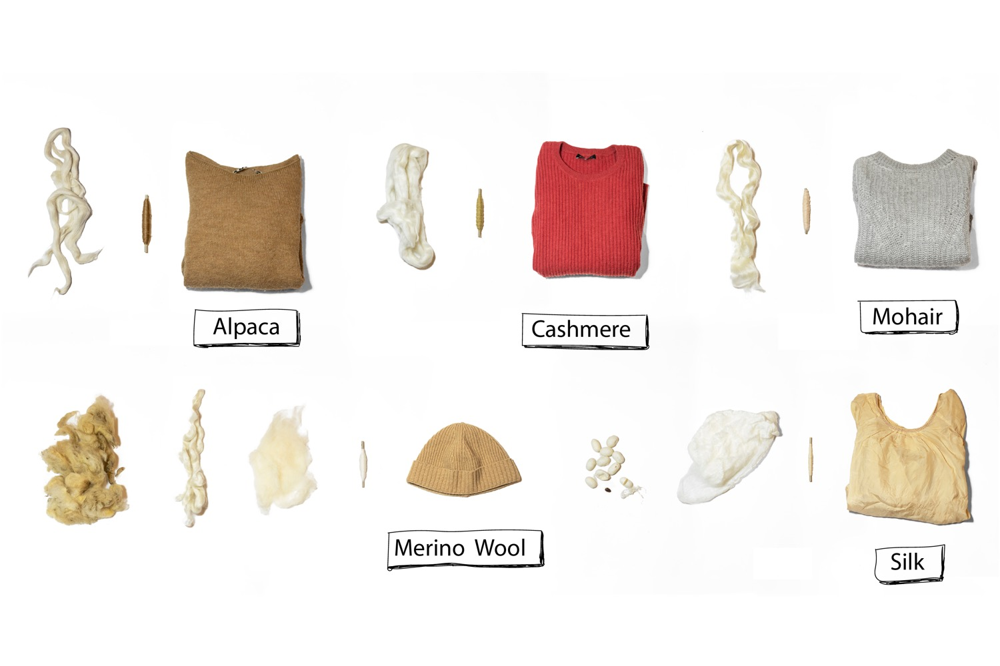
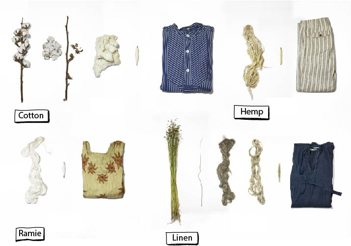
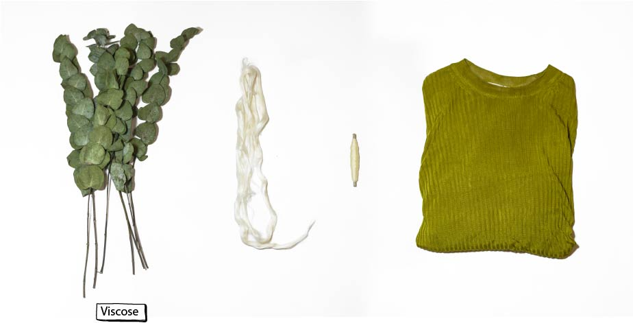
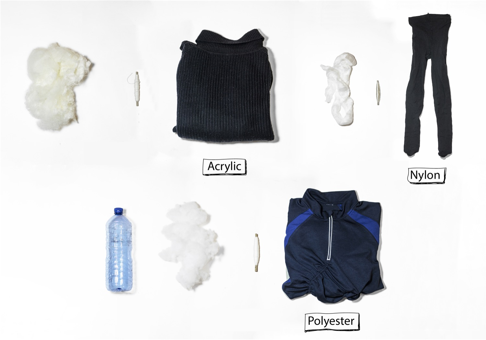

So what are fibres and why is it important to know what makes up your clothes? Fibres are the base of what textiles. It is good to know what fibres your clothes are made of, as each fibre has specific properties. Some fibres tend to shrink, others need fewer washes and some require extra care with a specific soap. Understanding the makeup of your clothes can simplify the caring process, dictating washing, drying and storage methods. This knowledge will give insights to what material is more durable or more sustainable over time.

# Different kinds of Fibres

| 🐑 Animal Based   | 🌱 Plant Based     | 🛢 Synthetic           |
|-------------------|---------------------|------------------------|
| 🐑 Wool           | 🌱 Cotton               |  🛢 Polyester             |
| 🐐 Mohair            | 🌱 Linen               | 🛢 Nylon/Polyamide        |
| 🐰 Angora            | 🌱 Hemp                 | 🛢 Acrylic Poly        |
| 🦙 Alpaca            | 🌱 Ramie                | 🛢 Elastane/Spandex/Lycra |
| 🐐 Cashmere          | 🌱Viscose (Artificial Plant Based)                | 🛢 Viscose                |
| 🐛 Silk              | 🌱 Tencel (Artificial Plant Based)                       |                        |

## 🐑 Animal based Fibres
Animal-based fibres are known as the Protein Fibres, which are fibres mainly based on the fur, hair or excretions (like cocoons) from Animals. Fur and leather are animal-based but are not fibres, they are fabrics. Instead, it is a natural material that is used for clothing and needs a different process, therefore it is not in this overview. We discuss leather and its alternatives shortly in the Basics of Fabrics.


**Wool:** Wool is primarily the hair of sheep. There are 1000s of different sheep breeds, but the most common wool is fine wool from the Merino sheep. Cheviot sheep wool is often used as it is firmer and a Crossbred sheep, a breed between the two, is also used frequently. The quality and the curl of the wool depends on the part of the body of the sheep. Lambswool comes from young sheep and is generally much softer and finer than from older sheep. Wool is a popular fibre as its structure intersects, also known as felting.

**Mohair:**The hair of the Angora Goat is called 'Mohair'. The fibres are soft, shiny, with little frizz and very resilient. The biggest exporters are Texas (USA), Turkey and South Africa.

**Angora:**
Angora is the fur from the Angora Rabbit. The hair is plucked or cut off and are very soft and tough. Be aware that a new cheap Angora sweater can be plucked, which harms the animal. The largest exporter of Angora is China.

**Alpaca:**
 Wool from the Alpaca. Used for expensive, fine fabrics. There are two types of Alpaca: Huacaya (which produce a dense, soft, crimpy sheep-like fibre), and the Suri (with silky pencil-like locks, resembling dreadlocks but without matted fibres). The biggest exporters are Peru and the Philippines.

**Cashmere:** Wool from the Cashmere Goat. Very soft and quality material. The biggest exporters are Mongolia, Iran, India, Tibet, China and Iraq.

**Silk:** Silk comes from the cocoon of the silkworm. The largest exporters are China, Japan, France, India and Italy.

## 🌱 Plant based Fibres
Plant-based are also known as the Cellulose Fibres. The name already says it, as the fibres come from Plants. Plant-based fibres come from the fluff of seed cases, leaves, husk or the stem or bark.

**Cotton:**
 Most common plant-based fibre is Cotton. Cotton is the seed fluff of the cotton plant, which comes out when the seeds are ripe. The quality depends on the length, gloss, and colour of the cotton and what country it is from and the type of cotton plant. Biggest exporters: U.S.A, Uzbekistan, China, India, Brazil, Pakistan and Turkey. Organic Cotton: India, China, Turkey and Kyrgyzstan.

**Linen:** Linen comes from the Flax plant. This is an annual plant, which contains bark or stems fibre. The bark of the flax plant is made up of bundles of fibres (the technical fibres), held together by a glue called pectin. Due to its long fibre structure and a high content of waxy components, linen has a beautiful shine that is wash-resistant. The linen fibre is coarser, more irregular and longer than the cotton fibre, which makes linen stronger than cotton. Biggest exporters: China, higher quality: Belgium, Italy and Ireland.

**Hemp
:** Harvesting Hemp is similar to Linen, where both are so-called bark fibres and need the retting process to make the fibre. Hemp is made from the stems of the hemp plant (Cannabis Sativa). It is one of the oldest fibres used for textile production. Because hemp today is widely appreciated as a sustainable fibre, it is now making a slow return in Europe and the USA. Biggest exporters: France, Netherlands, Romania, Croatia, Hungary and Switzerland.

**Ramie:** Ramie (Boehmeria Nivea) fibres come from the bark of the plant and are part of the Nettle family. Ramie is also called China grass, grass linen, grasscloth or China linen. As these names reveal, Ramie was cultivated first in Eastern Asia. Ramie fibres have been cultivated for more than 5000 years. Ramie fabric has never really been widely used in the textile industry for Western countries because the fabric is expensive and its processing is highly complex. In countries in Asia, such as Japan and China, ramie textile fibres are very popular. Biggest exporters nowadays: China, India, Brazil, South Korea, the Philippines and Thailand.

## 🛢️ 🧑‍🌾Artificial Plant based
We can imagine that this type needs some explanation: are they natural or artificial? Under Artificial Plant-based fibres, you see fibres where the fibre base is from Cellulose/Plant-based such as wood pulp from Bamboo, Eucalyptus or Nettle, but the process of these fibres are chemically processed, to make them useful for wearable textiles. The result is still plant-based as it still contains Cellulose.

**Viscose (Rayon)**  Viscose is regenerated from the cellulose of wood pulp, like stems from the Cotton plant, Pine or Bamboo and processed with sodium hydroxide and carbon disulphide. Most common viscose is from Bamboo as it is soft and silky. Bamboo - a fast-growing plant that doesn't require pesticides, herbicides or irrigation therefore often marketed as eco-friendly, can be produced on its own, but the process is highly labour intensive and long, therefore most produced bamboo fibre is Bamboo viscose. If a bamboo fabric is more expensive then it is likely to be 100% Bamboo. A more improved and more luxurious version of Viscose is called Modal. Although Viscose is a cheaply manufactured natural fibre, the process of making Viscose and Modal is a highly chemical process. The farming of wood pulp, like palm oil, was leading to deforestation when it was unregulated. Almost every year there is a new improved kind of fibre on the market, so there are better versions now of viscose.
Biggest Exporters: China, India, Indonesia, Brazil, U.S.A.

**Tencel™/ Lyocell** Tencel is a brand name produced by the Austrian company Lenzing AG that produces Lyocell. Lyocell is an improved version of Modal and Viscose. It is made with modern technologies that require less energy than traditional viscose manufacturing, and the chemicals used have low toxicity and are recycled in a closed-loop process.
For instance, it uses a different solvent to extract the cellulose from the wood a non-toxic organic compound with the catchy name N-Methylmorpholine N-oxide (NMMO for short). This organic solvent is easier to filter and is re-used in a closed-loop, which means 99% of the chemical compounds and water are reused.
The plant-based fibres (many Eucalyptus) are certified biobased fibres manufactured in an environmentally responsible production process that generates a certified compostable and biodegradable product.
Biggest exporter: Austria, Brazil.

## 🛢 Synthetic Fibres

Synthetic fibres, also known as oil-based fibres, are fibres that consist of artificial or chemical raw materials. They are made of polymers; a chain-shaped connection of molecules. Many types of polymers are made differently but have similar properties. The main synthetic fabrics you can find in clothing are:

**Polyester
:** Polyester is a human made fibre that is derived from crude oil petroleum and is a non-renewable resource. Accounting for nearly 50% of the global fibre production, polyester is the most widely used fibre in the apparel sector, being popular in the fast fashion industry, as it is cheap, fast to produce and versatile. It has the same polymers used in PET bottles. If it is Recycled polyester (rPET), it is derived from discarded clear plastic bottles instead of raw petrochemicals. Polyester fabric recycling, where the actual yarn is recycled, is less common. In this case, Polyester scraps and textiles are shredded and broken down into fibre components that are spun into yarn. Biggest exporters: China, Germany (rPET), U.S.A.

**Nylon/Polyamide
:** Polyamide fabric is a general term for a variety of different fabrics that are made from strings of polyamide monomers. The most famous type of a polyamide fabric is Nylon, which is branded by DuPont, but there are quite a few different varieties of this textile. While these types of fabrics are derived from carbon-based molecules, they are entirely synthetic, which means that they are inherently different from semi-synthetic fabrics, such as rayon, and fully organic fabrics like cotton. Nylon was originally developed by the DuPont Corporation in the mid-1930s as an alternative to silk stockings, which was very much a luxury item. Biggest exporters: U.S., China, Pakistan and India.

**Acrylic
(Poly-):** Acrylic (PAN) is lightweight, soft, warm, with a voluminous wool-like feeling. It is commonly used to replace Wool or Cotton. Acrylic is artificially made by petroleum (oil) and is a kind of plastic. While acrylic fibre might contain smaller amounts of other synthetic compounds, this fibre must contain at least 85% acrylonitrile to be considered authentic. In the making of acrylic, it takes a lot of toxic chemicals and needs a lot of resources which makes this kind of synthetic fibre one of the worst in terms of the environmental impact. Biggest exporters: Turkey and China.

**Elastane/Spandex/Lycra:**
 Elastane (general term)/ Spandex (working term: DuPont) and Lycra (branded name Dupont) all have the same process. This material is super stretchy and is very often mixed in with other fibres to make the clothing more elastic, both natural and other synthetic materials. Polyurethane elastomer, called elastomer for short, is usually processed as monofilament and has a built-in stretch. So it is not a natural rubber or a crimped synthetic material. Elastomers have better properties than rubber threads in most respects. Rubber has therefore largely been replaced by elastomers in the textile industry. Elastomers are lighter in weight, stronger, more durable and can be injected into thin filaments. Biggest exporters: China, U.S., India, Pakistan and Brazil.

**If at this point you have any questions about the basics make sure to visit our [community chat](https://discord.com/invite/SSBrzeR) on Discord. Many skilled and likeminded people in there :)**
