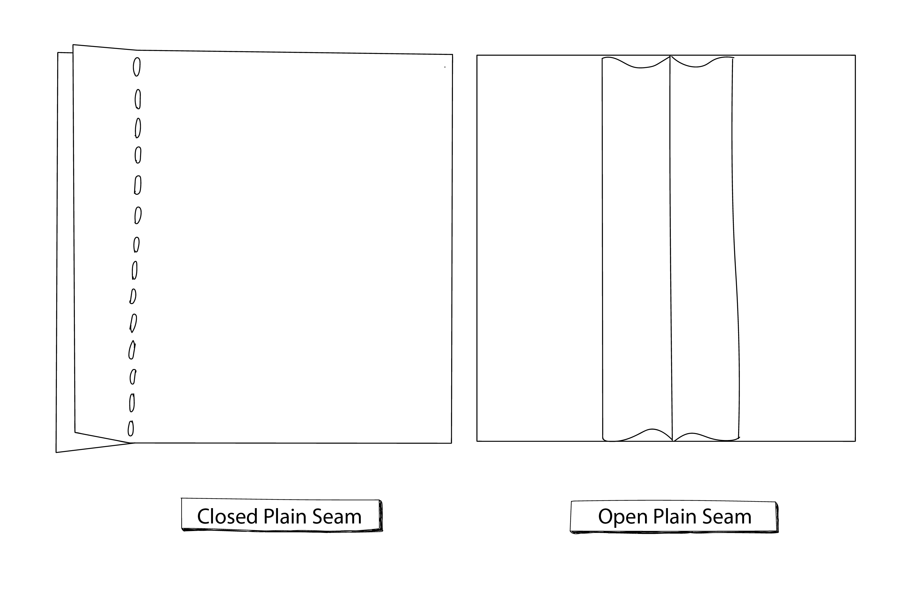
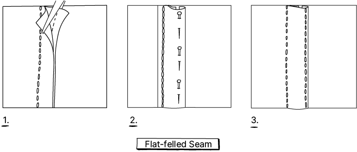
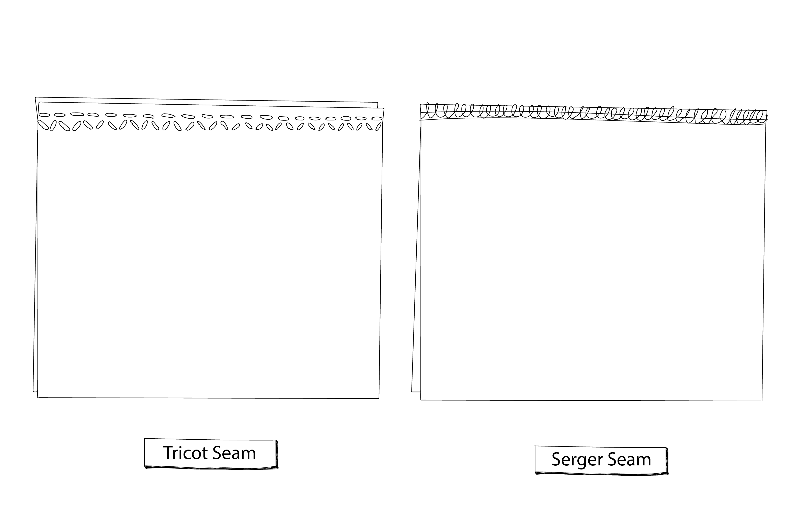

When you stitch two or more fabrics together you create a seam. With a seam, you can create shapes or finish a fabric into a garment. This knowledge is necessary if you need to upgrade your garment when reconstructing or resizing and repairing the seam when it has worn out.
There is a wide variety of seams and all have their purposes. Some seams are better to use for knitted fabrics and some are better for woven. Some suit bulkier fabrics and some are better for lightweight fabrics. Be sure to pick the right stitch and tension in the above table, as tension dictates the seam's strength and durability.
The most common seams you will find are:

## 1. Plain seam
A plain seam is the simplest type of seam and is a perfect all-rounder. A plain seam is defined as any seam that attaches two pieces of fabric with the good sides touching. The good side of the fabric is the outside of the garment and the seam will be on the outside. You can do this with a running stitch, zigzag stitch or tricot stitch. A Closed Seam is where the plain seam is ironed either to the right or left side. An Open seam is a seam where both sides are falling open. The seam edges can be finished with pinking shears, a zigzag stitch or lock stitch. In case of ripping seams, redo them or paste some Vliesofix from the inside, so the fabric doesn’t rip in the seam.

## 2. Shaped Plain seam
A Shapen Plain seam is a closed Plain Seam that is shaped and therefore needs some cuts from the 1cm bound to the stitch. This will create the space needed to get a neat shape. Or when it has a corner, cut the tip of the corners off, so the point gets sharp when you reverse it. Make sure to cut as close as possible to the stitch, but not through the stitch.
 

## 3. Flat-felled seam
Among all the seams the flat-felled seam is the strongest one and is therefore used in jeans and other workwear. A flat-felled seam is an extremely strong closed seam that won’t fray because all raw edges are covered in the seam and double stitched.

## 4. Welt seam
A welt seam is also frequently used for jeans, as it is highly durable. It is less bulky than the flat-felled seam because it is not enclosed, and the raw edge of the fabric is visible on the inside. You can then stitch it once or twice for extra strength.

## 5. French Seam
This is used more on higher quality and very delicate garments, like chiffon or silk, as the seam uses a lot of material and can get bulky with heavier fabrics. Since the edges of the fabric do not show with this technique, a French seam is also great for garments where you want to hide the seams, like an unlined jacket.

## 6. Bound seam
A Bound Seam is perfect for the edges of the fabric where you don’t have much to work with, like a thick coat or lining. The seam is made with a bias tape, which is a narrow strip of fabric. There are no visible stitches on the good side of the fabric, and on the opposite side, the fabric edges are neatly enclosed. You can also use it individually so the bias tape is visible and used as a decorative finish of a fabric edge.

## 7. Stretch seam
The above stitches are mainly for woven fabrics like jeans, shirts, blouses and coats but a lot of garments are knits. Running stitches are not stretchy and will break. Stretchy seams are preferably created by a serger/lock machine. A Serger/Lock machine is a special type of sewing machine that cuts the raw edges of the seam and creates overlocked stitches around the edge as it is sewn. This is a very professional way to finish a seam, and serged seams are found on most store-bought clothing. A lot of the time a lock machine stitch is also individually used as a stretch stitch. On your normal sewing machine, you can create it mainly with a narrow and short zigzag stitch on the edge of the fabric or 1 cm from the edge. If you have a tricot stitch or overlock stitch options, then you can use those 0,5 cm from the edge.

**If at this point you have any questions about the basics make sure to visit our [community chat](https://discord.com/invite/SSBrzeR) on Discord. Many skilled and likeminded people are in there :)**
