First of all, your sewing doesn't need to be beautiful, but it does need to be durable, as you don't want to be fixing the same problem over and over again. Eventually, we hope you do make something that shows your hard work and that you're proud of your repairs. You're proud that this shirt did not end up in a landfill or a container. That you bought it because you liked it and so you have taken responsibility for it and given the precious care it deserves.
Understanding the basics of sewing is vital for the art of repairing and upgrading. These basics will help you deliver quality results which will stop you from having to repair the same issue over and over again. Sewing looks easier than it is. But it is mainly a thing you need to continue to practice to get better at; it is a skill like many others. So, we will help you through this process of trying and failing so that you can become a master of the craft.
Before you start sewing, you need to know what yarn you are going to sew with.

# Tools
Some tools you really can’t work without for sewing are.
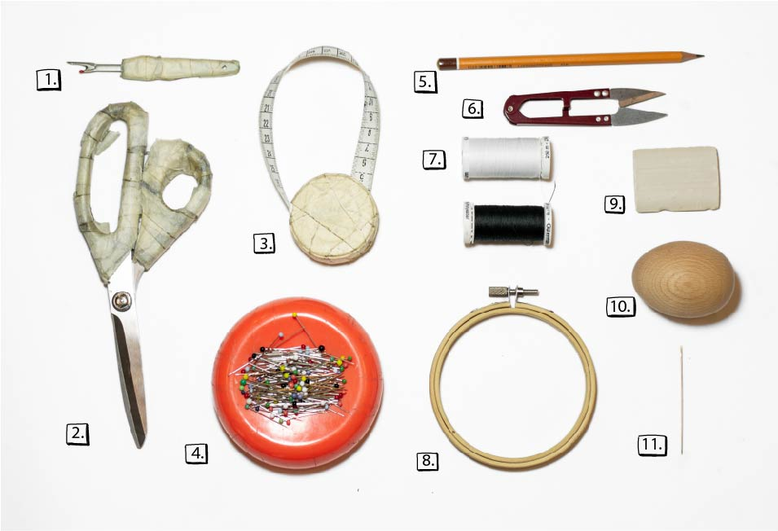
1. Seam Ripper: Seam Rippers are to remove stitches. This tool is to undo all the mistakes you may make or the seams of a garment. It has a V shape where the inside can be used as a knife to rip the thread.
2. A good pair of sharp scissors: These are extremely crucial. If you sew a lot you know how important a pair of sharp scissors are. Possibly as important as a good, working sewing machine.
3. Measurement Tape & Set Square: Measurement tape is needed to measure body shaped surfaces. A set square helps measure out a patch or a pattern, with 90 degrees or any sharp corners.
4. Pins & A Pin Cushion: Lazy sewers don’t like them, but in the end, you work faster with them. They keep everything in its place and you don’t risk having to redo your stitches. We recommend the pins with a round-tipped glass head as they are easier to use. It is nice to keep track of them, whether that be in a box or pinned into a little pillow or even easier a magnet. Magnets are great to use as you can pick up fallen pins with one pass over.
5. Pencil: For making patterns
6. Embroidery scissors: Sometimes it can be hard to cut a thread really short with a normal scissors, unless it is still sharp. This one is also nice to have on the way and need a repair.
7. Sewing thread: Universal yarn can be Cotton or Polyester based with or without coating or being mercerised cotton. Cotton based yarn is nice for a repair technique called Sashiko, but you don’t want to use it for seams as it shrinks in the washing machine. The small straight spools are for the sewing machine, the cone spools are used for the lock machines and are too big for a normal sewing machine.
8. Embroidery Ring and/or Darning Egg/Mushroom: Not crucial for sewing jobs, but are nice for repair jobs. A darning egg is preferred for the darning technique instead of the embroidery ring as you have a base underneath that keeps it tight. Embroidery ring is preferred for decorating and edge mending.
9. Markers Chalk: Instead of using a pen or a normal graphite pencil on your fabric, it is good to have a piece of marker chalk. The chalk is used to draw where you are going to cut or sew and does not leave marks or stains.
10. Darning Egg: This is a help if you do a lot of Darning work. Place the egg under the hole and it makes sure you have enough tension on the fabric to repair it and you don’t double stitch it.
11. Needles: There are a huge variety of needles, but with every how-to, we will tell you which ones are best for the job. Small-eyed needles are used for delicate fabrics. Bigger eyed needles are used for strong durable fabrics. Long needles are mostly for embroidery and repairing techniques. Short thin needles are for normal sewing. Middle-fat needles are for thick/leather fabrics. All hand sewing needles have the eye at the top of the needle.

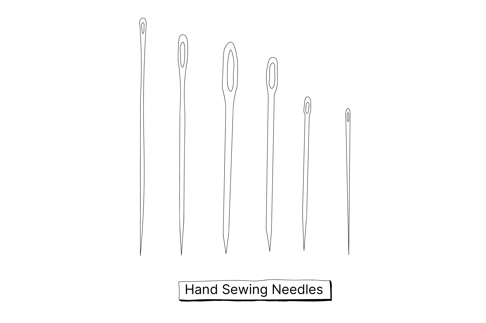

Machine needles: These have the eye at the bottom. Machine needles follow the same standards as hand sewing needles but are numbered. The higher the number, the bigger and stronger the needle. For an upcoming technique, you will need felting needles. These are needles that have intersecting hooks that felt the wool fibres together, but we will explain further in the Repair section.

For machine needles, the convention is delicate fabrics: 60-75, standard fabrics: 80-90 and heavy-duty fabrics: 100-120.
Needle felt needles: For the Needle Felting patch, you need  different kinds of needles. These needles have intersected hooks that push the fibres, mainly from wool, into each other creating felt.

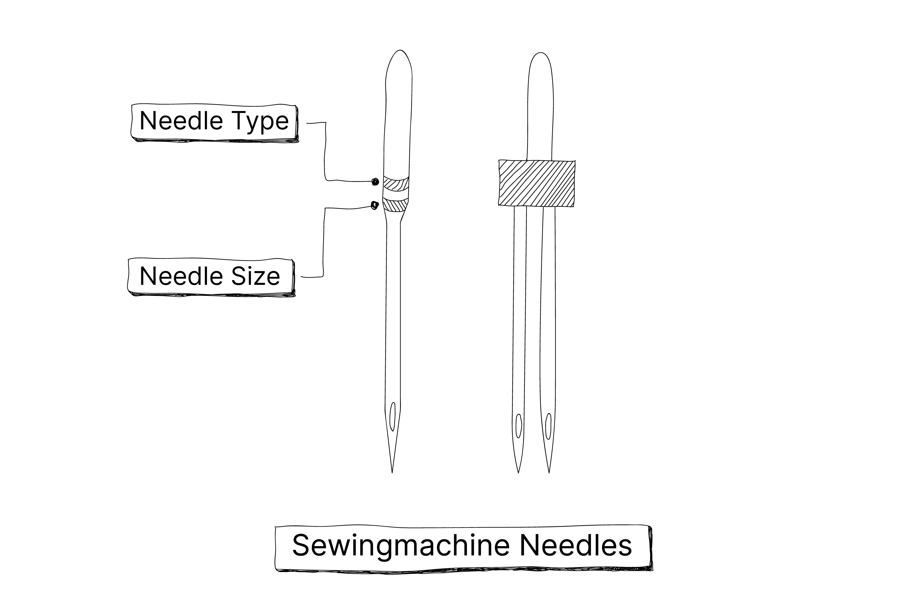

Sewing Machine: A machine is necessary if your patch requires strong stitches or when you need to finish fabric neatly. A modern machine may not produce a higher quality stitch but may have more functions and options that can save you more time. If your machine can already do some strong stitching with a straight or zigzag stitch you are set. Old machines can be just as good as new ones as long as you take care of them.

> Note: Always check if the needle is blunt with a test fabric because a blunt needle might cause damage to the fabric or skip the stitches.

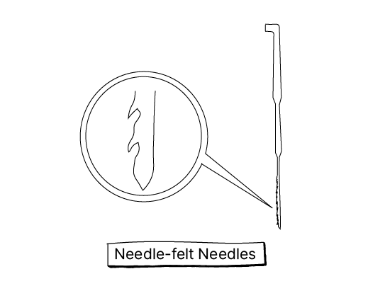

# Stitches
So, you have the tools and the yarn, which stitch do you use? Below we discuss the best stitches for each type of repair job or upgrading technique. There are two different methods of sewing: hand or machine. Neither is superior. It depends on what the fabric is (Knitted or Woven, Delicate or Durable, etc.) and where your stitch is placed on the garment.

## Stitching by Hand

Stitching by hand can be used for hard to reach places or when you don’t have a sewing machine nearby. Needle setup: Put your yarn/thread through the eye of the needle and leave the end of the thread in your hand while you hold the needle. Only double lace the thread when you need to sew on a button or beads for extra strength.

### One or Two-Loop Backstitch Knot:
A stitch to start and to finish your main stitch. On the sewing machine, it is called a Back Stitch.
1. To make a One-Loop backstitch knot, make a small backstitch on top of your last stitch. By picking one thread of the main fabric.
2. Then create a loop with the stitch, and draw the needle once or twice through the loop.
3. Pull the thread through tightly to close the loop and make a knot. Make a second one-loop knot for a Two-Loop Backstitch knot which requires extra security.
4. Clip the thread with enough yarn to sew a stitch.

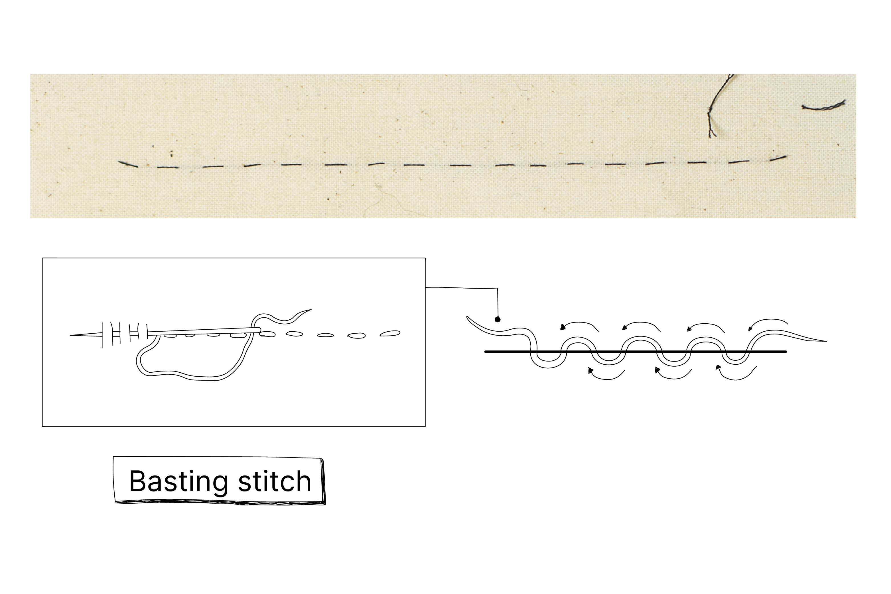

### Basting stitch + Running stitch:
The difference between the Basting stitch and the Running stitch is the spacing of the stitching.
1. Push the needle through the fabric up and down. Decide the spaces in between.
2. The stitches can be seen alternating at the top and bottom.
3. The Basting Stitch is a widely spaced stitch that can easily be removed. It can be used to keep something in place so it is easier for the sewing machine to go over. With this, a Cotton Basting yarn is used, which you can easily break. This is done when you can’t pin something because there are too many layers or when you need to resize a garment a basting stitch can be used to see how much you need to take off.

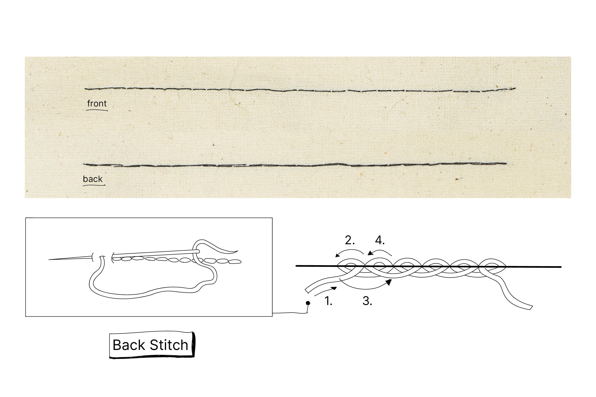
### Backstitch:
A good alternative to the sewing machine stitch, if you don’t have a sewing machine near you or you need to attach something quickly. The Backstitch works the same as the normal/running stitch on your sewing machine.
1. Start your backstitch by putting the needle in after a two stitch length and lift the needle in your work so your needle will be on the right side.
2. Reinsert one stitch back into the back of your work and repeat after two stitch lengths again.
3. Skip one stitch back again where your former stitch ended.
4. Repeat. Work from right to left and end with a Double Looped Back Stitch.

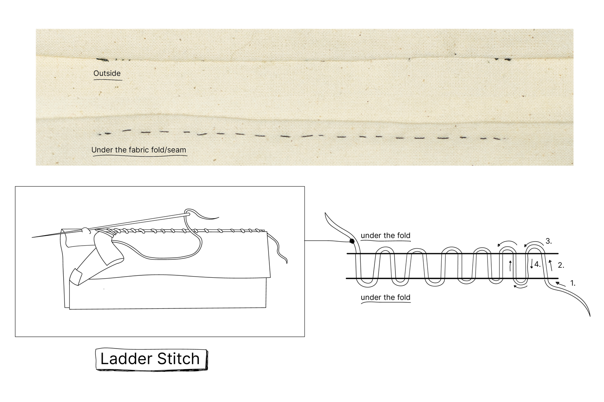

### Ladder Stitch:
The ladder stitch is used for closing seams that have opened or snapped. It can also be a great alternative to create an invisible stitch repair in the middle of a garment without using a patch. But we don’t recommend this in places with a lot of friction or tension, as it isn't the strongest repair. In those areas, it is best to repair with a patch. More about that in Repair
1. Start on the backside of your fabric. Make sure to be 0.5 cm off from the edge of the rip or start under the folded seam and continue under the fold of your seam.
2. Cross to the opposite of the rip or seam fold and end with your needle under that fold or 0.5 cm away from the rip.
3. Grab a little bit of fabric on the folded edge underneath the fold or from the edge of the rip. Jump again to the other side and continue working on the edges till the stitch closes the rip or seam again.

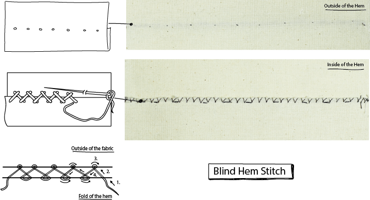

### Catch Stitch/Blind Hem Stitch:
A stitch identified by its criss-cross stitches, this versatile stitch is great for front-facing fabrics, circular garments (that you see from both sides) and tablecloths. It is used as an embroidery stitch and has a visible pattern. It is used as a decorative stitch to finish edges or to finish a visible fold. An invisible version of this stitch is called a Blind Hem Stitch and is useful to hem the edges of your pants or skirt. This stitch is perfect when a garment has been resized, made shorter, and it needs a new invisible hem. This is recommended for skirts, dresses or trousers or for lining of a coat.
1. Start on the folded end with your needle between the main fabric and the fold.
2. The catch stitch is sewn from left to right.
3. Whip with your needle two stitches to pick up some fabric from the front side, 2 threads is enough, from left to right.
4. Cross back and pick a stitch wide from the fold from left to right. The threads must cross. Do not sew it too tight as it will make the stitch visible, and you want it to be invisible. Finish it with a Double Looped Back Stitch Knot.

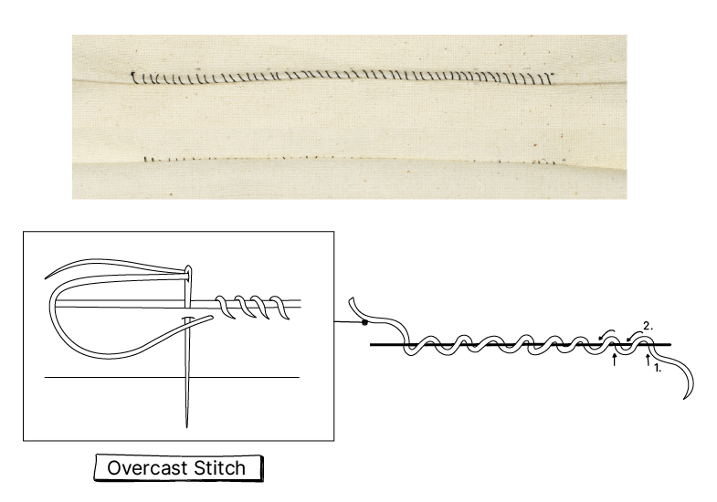

### Overcast Stitch:
With these stitches, you can finish the edges of a garment and secure it from unravelling. It can also be used as a visible aesthetic Stitch repair or to make a garment smaller. This is a good stitch for small knitted fabrics like t-shirts or to reattach Velcro or a pocket that has a loose corner.
1. Start with a double loop stitch 0.5 cm away from the rip or the edge.
2. Bring the needle through the other side of the rip. So the yarn goes over the edge. With each stitch, the needle should always come through in the same direction. Push the needle a little bit further from your former stitch. As you add stitches, the thread should be wrapping around the edge of the material. Keep the same distance between the stitches for a neat look.

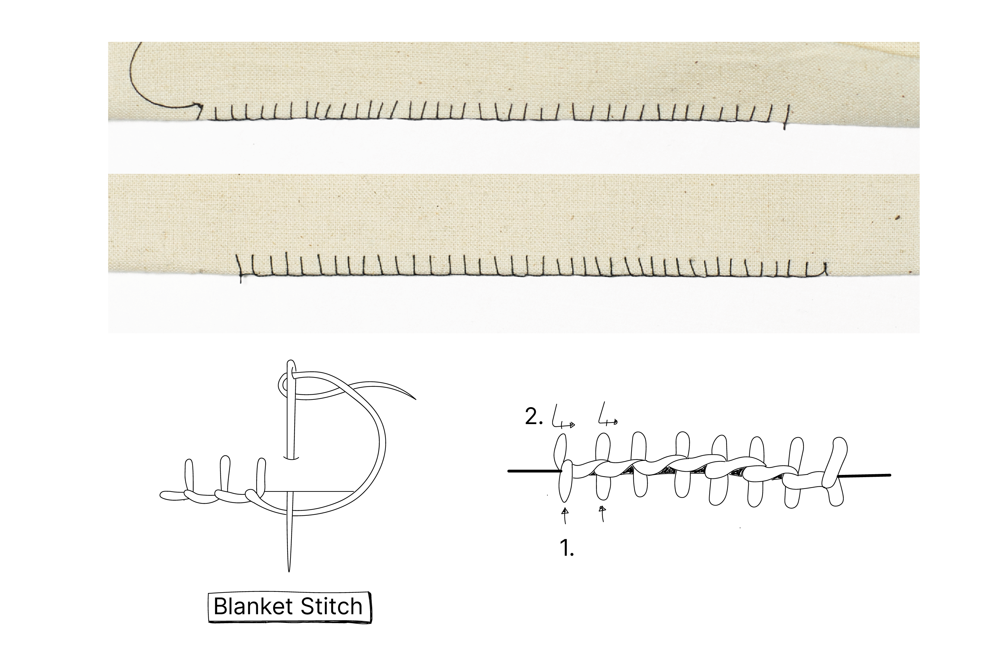

### Blanket Stitch/Buttonhole Stitch:
The Blanket Stitch is a stitch used to reinforce the edge of thick materials. It is a decorative stitch used to finish an unhemmed blanket or edge. The stitch is visible on both sides of the fabric. The Buttonhole Stitch is a closer spaced Blanket Stitch. You can repair an unravelling buttonhole and is now ripping further and getting bigger, causing the button to fall out of the hole every time. You can use the buttonhole stitch to embroider around a rip and leave the rip open, creating the Edge Mend, seen here.
1. It works the same as an overcast stitch, but you put your needle back in your stitch, so it gets this cover on the side.
2. So you start with a double loop stitch 0.5 cm away from the rip or the edge.
3. Bring the needle through the other side of the rip. So the yarn goes over the edge.
4. Before you do the next stitch. Lace your needle in under the former stitch and make the new stitch on the other side of the edge. With the next stitch, pick up the former stitch again, so it covers the side again. Depending on where the stitch is placed is how wide the stitch should be spaced out.

### Chain Stitch (Embroidery):
There is a wide variety of Embroidery stitches. The Chain Stitch is our favourite as you can visibly decorate your garments by creating drawings or words. Examples you can find in the Upgrade section, under Decorate here.
1. The Chain Stitch is created by making a small Back Stitch.
2. By going forward from the back of the fabric, you can loop the yarn around the needle when it’s half in.
3. Then do a little Back Stitch, in the loop where you started so it is almost invisible.
4. Eventually go forward again from the back of the fabric and loop the yarn around the needle. From there wrap the yarn over it again.
5. Continue like this till you create a Chain looking stitch.

These are the stitches we use in the Repair and Upgrade Sections. Other stitches will be explained later by adding more techniques to the website.

## Stitches by Machines
Stitches by machine are a little bit different as they are seen as functions of the machine and are mainly explained in your sewing machine's manual. New machines have different functions for stretch stitches or even embroidery stitches. With every machine it’s different, some stitches are better suited for different sewing projects and it makes your work neater, so better take an hour to read that manual. The main stitches you should know:

| Icon    | Description |
|---------|--------|
|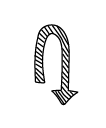 | Backstitch: this is the reverse button on your sewing machine, as it retraces the stitch. This is to secure a stitch from unravelling and is applied at the beginning and the end of the stitch. You can also apply this for the Stitch Repair or Zigzag Repair. |
| | Running Stitch: Is the most known stitch on every sewing machine, otherwise known as the straight stitch. This stitch is used for almost every seam, stitch, patch or hem. If you want to repair a seam, you can simply re-adjust the seam by going over the old one with the running stitch. As a hem, the stitch is used as a top-stitch or double folded hem, seen on jeans finishing. If you want to Resize your jeans this is a good finish.|
| | Zigzag Stitch: A stitch for stretchy or knitted garments as the zigzag stitch stretches with the fabric. It is also great to strengthen a patch on a woven fabric. A closed spaced zigzag is a nice way to finish the edge of a garment.|
| 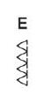| Tricot stitch: Than modern machines consist of Tricot/Stretch stitches. A great stitch for the seams of a knit and finishing the hem, if you don’t have a Double Needle. It’s, primarily, used to create stretchy seams for knits. Check for this one in the manual of your machine as well, as the stitches and functions differ.|
| | Buttonhole: Check for this function in your sewing machine manual as well. A buttonhole foot and button making function are required on your sewing machine. If you don’t have a sewing machine or this function, check out the hand sewing options. The buttonhole should be 0.2mm larger than the button. When you are happy with your buttonhole stitch, you can rip the fabric in between the stitching with a seam ripper. Redoing a buttonhole with this function is not that easy, and we advise to repair by hand.|

> Note: The Running stitch is not recommended for stretchy knitted fabrics, as the stitch will snap. You can apply the running stitch as a finish, using a Double Needle to apply the Running stitch. 

|                  |   Hand   |  Machine | Woven    | Knitted   | Finish  |   Seams   |
|------------------|----------|----------|----------|----------|----------|-----------|
|Basting stitch     |    ✔     |      ✔    |   ✔       |   ✔       |     -     |      -     |
|Running stitch     |       ✔   |       ✔   |      ✔    |     ✔/-     |  ✔        |    ✔       |
|Ladder stitch      |    ✔      |   -       |     ✔     |     ✔     |     ✔     |    ✔       |
|Blind Hem stitch   |     ✔     |   ✔/-       |  ✔        |    -      |     ✔     |    -       |
|Overcast stitch    |      ✔    |     -     |      ✔    |   ✔       |    ✔      |       ✔    |
|Blanket/Button Hole stitch| ✔         |  ✔/-        |    ✔      |      ✔    |   ✔       |   -       |
|Chain stitch       |    ✔      |       -   |     ✔     |   ✔       |   ✔       |  -         |
|Back stitch        |     ✔     |      ✔    |    ✔      |   ✔       |       ✔   |    ✔       |
|Zigzag stitch      |      -    |        ✔  |    ✔      |  ✔        |     ✔     |     ✔      |
|Tricot stitch      |       -   |     ✔/-     |    -      |     ✔     |     ✔     |     ✔      |

# Troubleshoot list for Sewing Machine
1. **The machine is skipping stitches.**
If this is happening, make sure the needle is correctly inserted and it is neither blunt nor bent. The bobbin underneath might be placed counter-clockwise and needs to be clockwise. Therefore it can’t make the loop properly.
2. **The stitches are irregular.**
Check if the tension is not too tight (it can break) or too loose (it is not durable). If your set up is fine, then it might be that you pull or push the fabric too much, while sewing. If you are trying to go faster, do it with your foot pedal.
3. **The upper thread keeps breaking.**
All possibilities above apply for this issue. The upper thread tension might also be too tight or the yarn is either bad quality or is old.
4. **The needle keeps breaking.**
Always check if the needle and bobbin case are properly in their holders and that the needle is not too thin for the fabric. Also, be sure not to push or pull the fabric which will bend the needle and cause it to break on the needle plate.
5. **Knots and loops keep appearing under the stitch.**
The tension of the upper thread is not laced properly or the tension button is too loose or too tight.
6. **Loops are created above the stitch.**
The bobbin underneath might be laced in a counter-clockwise direction or is not correctly in.
7. **The machine is stuck.**
The fabric is either too thick or there is a knot underneath, the bobbin underneath is not well placed or you didn’t lift down the presser foot. Lift your foot, use the dial and slowly pull the fabric out. Check your machine and the bobbin case, place it in again and restart.
8. **Stitch is never straight.**
Use the ruler on your needle plate, this also spares time drawing a sewing line on your fabric. On most sewing machines, there are guidelines in the needle plate. This is the distance from the needle to the edge of the fabric, which can be 1, 1.5 or 2cm. It works as a constant ruler to stitch straight from the edge. If you don’t have the lines on your needle plate, you can put a tape 1 cm from the needle.
