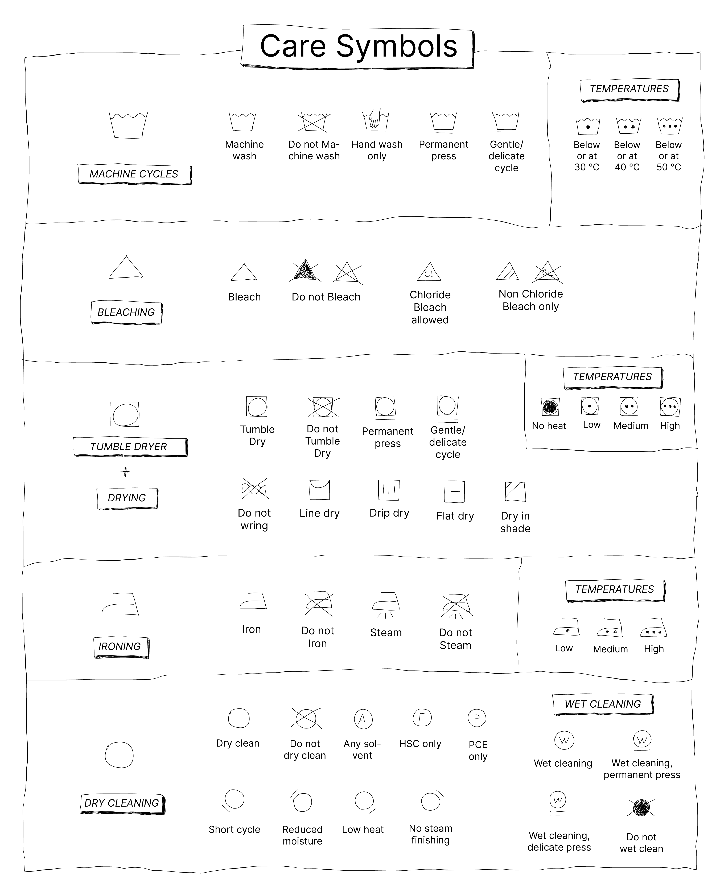
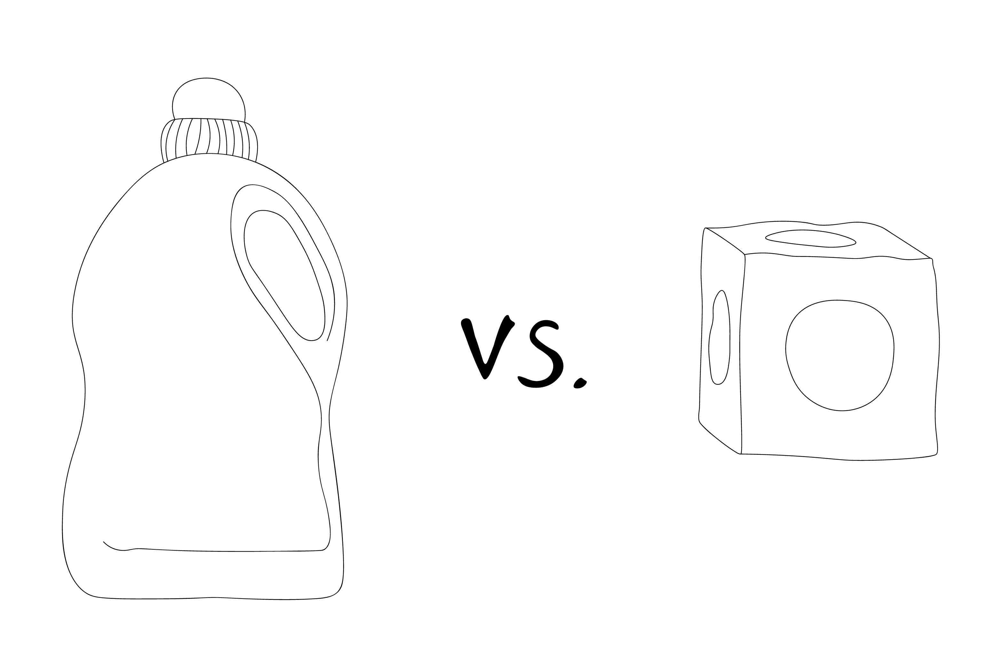
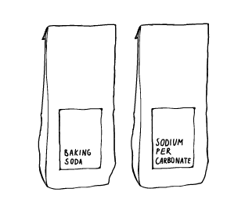

  <iframe width="800" height="400" src="https://www.youtube.com/embed/x7R9xCrkDyA" frameborder="0" allow="accelerometer; autoplay; encrypted-media; gyroscope; picture-in-picture" allowfullscreen></iframe>

# 1. Stains
Often garments are thrown away because stains were impossible to remove, but there is always something you can do. Ideally, you act on a stain as soon as it happens! Identify the spot and check what is necessary to remove it. You can easily replace the heavy chemical detergent for more natural ingredients, consisting of single elements. With these are the 9 ingredients, you can replace all your common chemical stain removers.

### Cleaning Toolkit:
1. Distilled vinegar, 5-8% Acetic acid
2. Bile soap/Ox gall soap (not vegan)
3. Lemon, Citric acid
4. Hydrogen Peroxide, for the heavy stains
5. Table Salt
6. Baking soda/Sodium Bicarbonate (NaHCO₃)), if you think not effective enough then replace it or combine it for Washing soda/Sodium Carbonate (Na2CO3)), don’t use Washing soda to much on Protein fibres
7. Dishwash soap
8. Toothpaste with glycerine and Sodium fluoride
9. Green Soap

### Stains overview
Below is a chart that shows a few stains and whether you can remove them. Scroll down below to see how to do it, if you don't know what 🛢 Synthetic, 🐑 Animal-Based or 🌱 Plant-Based Fibres mean check out the Basics here.

>Note: After treating the stain, wash it in the washing machine while it is still fresh and wet. If you let the stain dry it will bite in the fabric, which makes it harder or even impossible to remove.

|             |      Solution    | Needed Tools   | 🛢| 🐑 | 🌱|
|--------------|--------------|--------------|--------------|--------------|--------------|
|🧈 Grease/oil/Butter|Cold water|Ox gall soap|✔|✔|✔|
|⚙️    Rust|Cold water|Salt + Lemon juice|✔|-|✔|
|💦 Sweat|Cold water|Baking Soda/Washing Soda (GreenhubⒸ)|✔|-|✔|
|🖊 Ballpoint|Vinegar|Toothpaste|✔|-|✔|
|🖋 Pen Ink|Vinegar|Toothpaste|✔|-|✔|
|☕️ Coffee|Cold water|Baking Soda + Lemon|✔|✔|✔|
|🦷 Toothpaste|Hot water|-|✔|✔|✔|
|🍓 Fruit |Hot water|Lemon + Vinegar |✔|✔|✔|
|🍛 Curry/Turmeric|Hot water|Bile Soap + Lemon Juice|✔|✔|✔|
|🍷 Wine |Hot water (boiling)|Salt + Distilled Vinegar|✔|-|✔|
|🍫 Chocolate/Cacao|Cold water|Bile Soap|✔|-|✔|
|🍞 Flour/Powder |Hot water|Dust off|✔|✔|✔|
|🧱 Mud |Cold water|Dust off/ Bile soap|✔|✔|✔|
|🖍 Glue  |Hot water|Vinegar|✔|-|✔|
|🎨 Paint |Cold water|Green Soap or Vinegar + Hydrogen Peroxide|✔|-|✔|
|🍅 Tomato Sauce |Cold water|Green soap + Bakingsoda|✔|✔|✔|
|◻️ Chewing gum |Cold water|Toothpaste|✔|✔|✔|
|🩸 Blood |Spit|-|✔|✔|✔|

### Methods on how to clean each stain
 
**🧈 Grease/Oil/Butter:** Try to remove the excess with a dry cloth. Blot some Ox gall soap wet and rub on the stain. Rinse it out.

**⚙️ Rust:** Use some salt and spray some lemon on top. Leave it in for 30 minutes and remove with cold water. Repeat till it's gone.

**💦 Sweat:** Depending on how old the stains are, is how hard your mixture needs to be. Quite new stains can be removed with Baking Soda. Cover the stains with Baking soda and a few drops of hydrogen peroxide, rub it with a sponge or a toothbrush. Let it sit for 30 minutes. Rinse it out by hand in warm water. If the whole garment is yellow or the stains are pretty old, you can make a warm water bath with Washing soda, let it cool down. Leave the shirt overnight if the garment is white. If it is coloured leave it in for an hour.

**🖊 Ballpoint:**  Ballpoint is one of the hardest stains and needs to be pretreated before you put it in the washing machine. You can use some hydrogen peroxide, but that is quite heavy for the fibre if used in large quantities, definitely for Woollen fibres. Toothpaste works fine as well and is a bit more natural if the stain isn't too heavy. Use paste-based toothpaste that contains glycerol, sodium fluoride and is naturally based without any flakes. If not, not much happens to the stain. You may need to repeat this process depending on how heavy the stain is. Rub a good amount of toothpaste with a toothbrush on the stain and let it sit for 10 minutes. Then rub it in again and rinse off the toothpaste with cold water. Repeat this till it is fully gone.

**🖋 Pen Ink:** Apply the same process as Ballpoint.

**☕️ Coffee:** If it is a new stain, try to rinse it off with some cold water to dilute it. If it is still in there and you are not nearby some of the ingredients, try to bolt it with a bit of dishwashing soap on top of the stain, and rinse with water till it is gone. If the stain is set, make a mixture with 2 tablespoons of baking soda + dissolve with warm water. Dip a cloth or a toothbrush in the mixture and rub it on the stain. Rinse off with cold water and repeat till it's gone. Wash it straight after.

**🦷 Toothpaste:** Annoying because in black clothes it looks like they faded away when wet, but dried up again it’s still there. Just use a fair amount of hot water and it’ll wash out.

**🍓 Berry/fruit stain:** Lemon has the same acidity and takes out the colour of the berries or any kind of natural fruit colourants and Vinegar makes sure the tannins in the stain don't give a different stain colour. If you are in a restaurant you can already ask for a lemon to pretreat the stain. Then remove it after with 2 tbsp vinegar and water. Keep repeating if it is stubborn.

**🍛 Curry:** Although the component Turmeric is used to dye fabrics as it is a tannin based stain, which means it bites easily, still, it is possible to remove it naturally. So first scrape the curry off. Pour some vinegar on it and in the meantime make a bath of warm water and baking soda and pour it on the stain. Leave it for 30 minutes. Rinse again and repeat till the stain is removed. If not use a bath of hydrogen peroxide. Leave it in the laundry.

**🍷 Wine:** Wine is quite acidic and consists of tannins that bite in the fabric. So act fast! Pour salt on the stain and the edges till it fully covers. This will absorb the excess wine of the stain. Meanwhile, boil water in a kettle. Put the stain in a bowl, place in the sink and pour hot water on the stain. The stain should wash out as it gets more alkaline. Beverages containing sugar and tannins, such as wine or fruit, may seem to disappear. But don't be fooled - they may still be there! Once the stain has been exposed to air, the sugar oxidizes and leaves an invisible stain, which ultimately turns yellow, brown or pink. To avoid that, pretreat the shirt with distilled vinegar, so it goes back to being acidic and shows how much of the stain is still there as it becomes pink. Rinse it off with hot water again, dip in vinegar and rinse off with hot water again till the stain is fully out. Then wash it in the machine.

**🍫 Chocolate/Cacao:**  If it is Cacao powder, dust it off first. Remove the left-over stains with water and ox gall soap/bile soap or dishwashing soap. Rinse off and repeat till it is gone.

**🍞 Flour/powder:** Just dust it off, otherwise rinse under the hot water tap.

**🧱 Mud:** Let it dry and then brush it off. Remove the left-over stains with water and ox gall soap/bile soap or dishwashing soap. Rinse off and repeat till it is gone.

**🖍 Glue:** Scrape off the glue residue. Make a bowl with ⅓ hot water and ⅔ vinegar. Leave the stain to soak as it becomes white. Now try to scrape it off. Wash it after with Washing Soda.

**🎨 Paint:** Scrape off the paint residue. For water-based paint let it soak in water and mix it with some greasy soap, like Green Soap or dishwashing soap. If oil-based, use greasy soap to remove the rest and then leave it in a bath of hydrogen peroxide.

**🍅 Tomato sauce:** Tomato sauce is just like wine, a tannin based product, which bites in the fabric. So act as soon as possible! Remove as much of the excess tomato sauce with a spoon. Rinse the back of the stain with cold water till most of it has faded out. If it is a fresh stain, cover the stain with green soap and leave it for a while. If it is a set stain, make a mixture of washing soda and water and rub it on the stain with a cloth or toothbrush. Leave it for a while. Then rinse it off with warm water and wash it normally.

**◻️ Chewing gum:** This can be super annoying but is also very easy with very cold water and toothpaste. Make it cold first with water. Brush with an old toothbrush some toothpaste on the chewing gum until it falls off. Then remove the leftover bits, and wash it off with water.

**🩸 Blood:** The weirdest one so far. But during sewing, you might pin yourself and without noticing have a bloodstain on your clothes. The enzymes of your spit, react with your blood enzymes. So spit on the stain and blot it away with a clean cloth. Then rinse it off with water. Note: only your spit reacts with your blood.

# 2. Know the washing labels
The washing instructions on the label are the only form of transparency a producer can give to the consumer, as the labels are regulated. The full label gives you information on how to wash your clothes, where it’s made and what brand and manufacturer made the garment.

### No label?
No clue what to do with your washing, because you have already cut out the labels or you bought a second-hand shirt without one? Then there are always steps by guessing the fibre of the garment and what the fibres general washing guidelines are. Try to wash your clothes as little as possible. Most clothes don't need to be washed after every wear. The more you wash them, the more they lose their quality. Wash your main clothes around 30 degrees. This temperature not only requires less energy, but it is also better for the fibres as the fabric doesn't undergo the added stress of overheating. But there are a few exceptions. In the Basics, we discussed what Fibres are and how they are divided in Plant-based, Protein-based and Synthetic based. It is important to know that as some of these fibres require different treatment methods. You learn by doing, but hopefully, the table underneath helps you out.

| 🌱 Plant Based |Washing after| Washing temperature | Hand or Machine| Drying | Ironing|
|-------|----|----|----|------|------|
| Underwear and towels (Cotton)| After every wear| 30-60℃|Machine|Line/Tumble| High|
| Delicates |After a week|40 ℃ | Hand | Line | No|
|Jeans (Cotton or Cotton/ Elastane)|When stained|15-30℃|Machine|Line|No|
|General clothing (like shirts, pants etc.)|When stained or smelly|30 ℃|Machine|Line/Tumble|High|

 

| 🐑  Animal Based | Washing after| Washing temperature | Hand or Machine| Drying | Ironing|
|-------|----|----|----|------|------|
|  Merino Wool (Knitted)|  Preferably not| 15℃ | Hand | Flat | Middle High |
 | Alpaca (Knitted) | Preferably not | 15℃ | Hand | Flat  | Middle high |
 | Mohair (Knitted) | Preferably not | 15℃ | Hand | Flat | Middle high |
 | Cashmere (Knitted)  | Preferably not | 15℃ | Hand | Flat | Middle high |
 | Silks | After every wear | 30℃ | Hand | Line dry | Very low |
|  Leather | Not at all | - | - | - | - |
 | Fur | Not at all | -  | - | - | - |

 

 | 🛢 Synthetic | Washing after | Washing temperature  | Hand or Machine | Drying  | Ironing |
 |-------|----|----|----|------|------|
 | Sportswear (Polyester)  | When dirty | 30-60℃ | Machine | Tumble/ Line dry | Low temp.  |
 | Tights or Swimwear (Nylon/Polyamide) | After every use | 30-60℃ | Machine | Tumble/ Line dry | No |
 | Acrylic (Fleece or Sweaters) | When dirty | 30-60℃ | Machine | Tumble/ Line dry | No |
| Spandex/Elastane (Blends) | When dirty | 30℃ | Machine | Tumble/ Line dry | No |
 | Viscose (General clothing) | When dirty | 15℃ | Machine | Tumble/ Line dry | Low temp. |
  | Modal (General clothing) | When dirty | 15℃ | Machine | Tumble/ Line dry | Low temp. |
 | Tencel (General clothing) | When dirty | 15℃ | Machine | Tumble/ Line dry | Low temp. |

# 3. Detergents and Softeners
Ideally, for every fibre sort, you need a different washing detergent. But having all of them can be pricey and a lot of work to find out if it contains natural ingredients. The simplest and cheapest option is making your own detergent. This detergent recipe is not only ecological, but it’s also healthy and soft for your skin, very cheap and since you made it, you know exactly what is in it. Marseille soap, which uses olive oil as a base, contains no synthetic fragrances, phosphates and optical brighteners. It washes as a normal detergent. But, for really heavy stains, it’s better to pretreat it with stain removing soap, like Oxgall/Bile soap or black soap (great for sweat, coffee, fruit and butter stains).

### Tools + Ingredients:

- grater

- boil pot

- wooden spoon

- glass bottles or any large container

- 80 gr Marseille Soap

- 5l water

- funnel

- mixer

- essential oils (optional for smell)

- Baking Soda/Sodium Bicarbonate (optional for bleach)

- Vinegar (optional for colored)

### Steps to make normal washing detergent
1. Grate the Marseille soap straight into the pot.
2. Add 1 litre of water and let it boil for a few minutes.
3. Add another 4 litres of water and let it boil again for an hour.
4. Stir it well, put the pot away for a night and let it cool down. After the night the detergent is a little bit thicker, stir it well with a mixer.
5. Using a funnel helps to get the soap straight into the bottles. Mark the bottles with white and colored.

> TIP: Use about 20 ml of washing detergent every wash and every time 10 drops of essential oil in the detergent drawer. Don’t put the essential oil straight with the washing in a dosing ball, cause directed contact with essential oil on clothes may cause stains!


**For White wash:**
Add Baking Soda/Sodium Bicarbonate to the detergent drawer or make a separate bottle with whitewash detergent. Make a bowl of detergent soap + Baking soda first and let it dissolve first, before putting in the bottle. Can get foamy.

**For Black + Colour wash:**
To keep the blacks as vibrant as possible you can use vinegar. If you don’t like the smell of Vinegar. Mix the Vinegar with some orange peels and let it sit for a week.

**Softener:** Vinegar is also a good alternative to replace fabric softeners. Put a household vinegar in a pot with some orange peels and some lemon peels. Vinegar kills bacteria and removes little soap rests in your clothes and even the machine. Both will be more durable.

# 4. Checklist before washing
1. **Pockets:** You don’t want any ‘to-do list paper pulp’ on your clothes that takes an hour to remove. Or a screw that rips your pocket (this sounds like this has happened to me before). So empty your pockets before you wash your clothes.
2. **Zippers and buttons:** If you don’t close zippers they zipper might be stuck into the other garment, and could make a little rip in fragile fabrics. Open all buttons and hooks to prevent them from ripping off the fabric.
