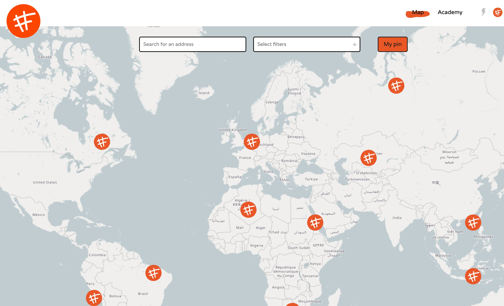

# How to get on the map
We have two different types of profiles in the community **members** and **spaces**. We explain more about them [here](https://community.fixing.fashion/academy/guides/profile). Members can add themselves to the map without verification. Any individual can create an map pin as a member and connect with likeminded people. Spaces on the other hand are screended. This is mainly to make sure the Fixing Fashion map stays clean and pure.
So here are the guideliness for adding a map pin for your space.

1. Make sure your profile has images of your space
2. Have a clear description of your space in english
3. Explain the service your space brings to Fixing Fashion (repair or upgrade clothes)

Once your pin is added it will take usa few days to review. Once approved its will be on the global map. Good luck!

**If you have any questions about this topic sure to visit our [community chat](https://discord.com/invite/SSBrzeR) on Discord. Many skilled and likeminded people are in there :)**
