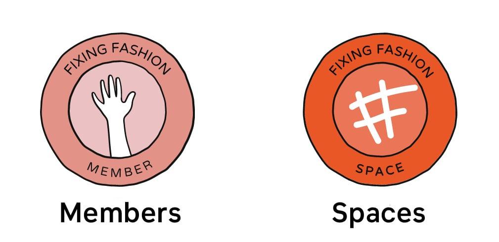
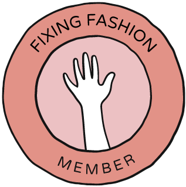
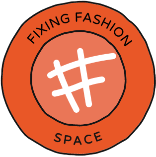

Hi welcome to the Fixing Fashion Community!

The project is still in early stages so good to see you here wanting to join. At the moment community members are dived in two different types: Members and Spaces. Members are individuals looking to connect and interact. Spaces are up and running and repair or upgrade clothes.  Here you can see the difference

|   Icon   |    Information  |
|------|------|
|   
     **Members** 
 |   - An individual   - Want to get started with Fixing Fashion  - They might already fix their own clothes but consider becoming a space  - Are looking for other people in the community to collaborate with  |
| 
     **Spaces** 
 |  - And individual or group  - Already started with Fixing Fashion and setup a space - They Repair or Upgrade Clothes and provide a service to others  |

This are the two layers we start of with. We will add more in the future as the project grows.
If you have any questions about this topic sure to visit our [community chat](https://discord.com/invite/SSBrzeR) on Discord. Many skilled and likeminded people are in there :)
