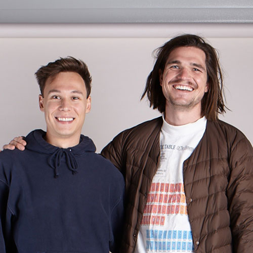
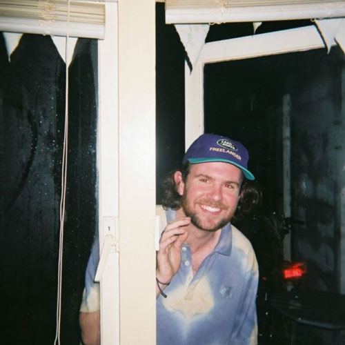
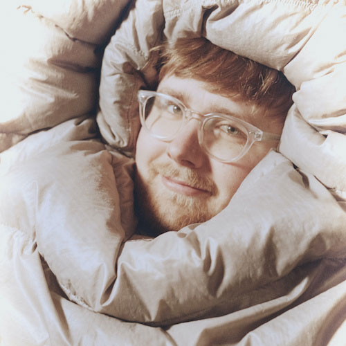
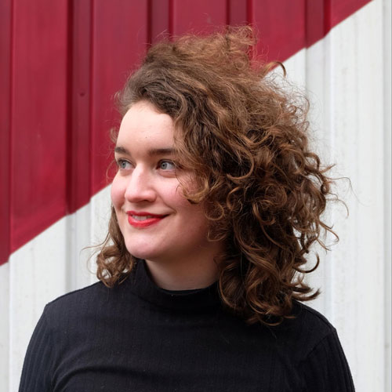
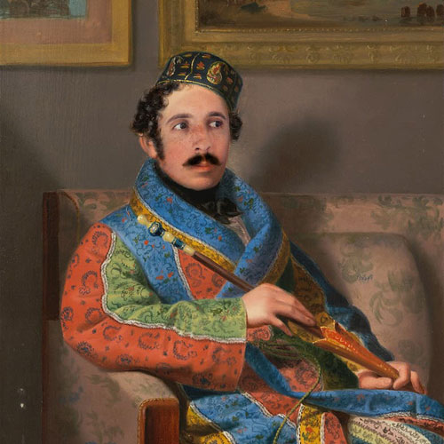
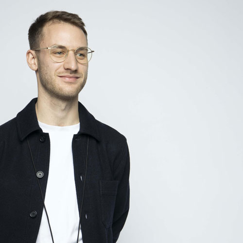
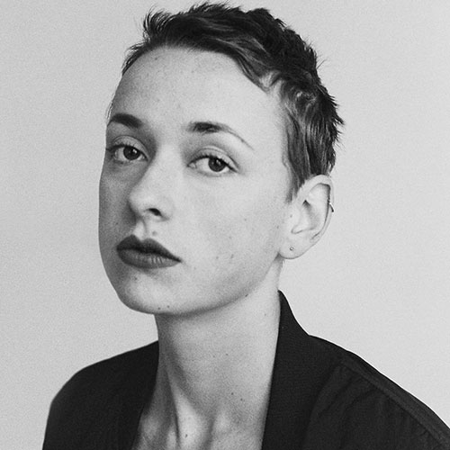
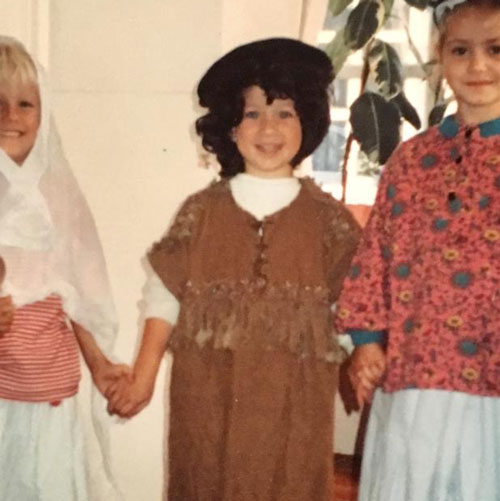

# Here is the team behind V1.

|     What they look like            |      What they did             |
|-------------------|----------------------|
|  |   **Almanac (James and Dannÿ)**   Helped out with early-stage research and brand identity design.                |
| | **Hugh Coombs**  Communication Strategy, Photography, Social Media, Press & Slate Clapper                   |
| |   **Filip Sjögren**  Making the academy videos                 |
| |  **Alicia Minnaard**  Project mom, Creative Direction, Concept Development, Fashion Design, Research on Techniques + Community + Problem, Content and Illustrations Academy                  |
| |     **Mattia Vega**  Website               |
| |      **Nicolas Paries**  Brand & Web Design             |
| |    **Louis Bindernagel**   Content & Research                |
| |     **Louisa Stickelbruck**    Editorial photography for the prototype collection. Film work during the field trip to Accra, Ghana.           |
| |   **Dave Hakkens**    Try to glue it together                  |
