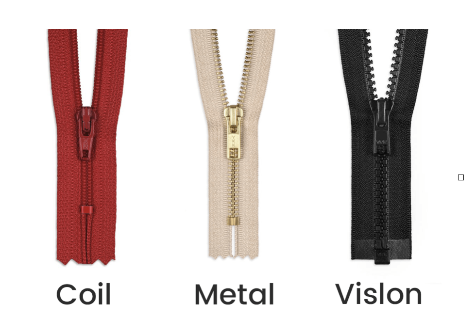
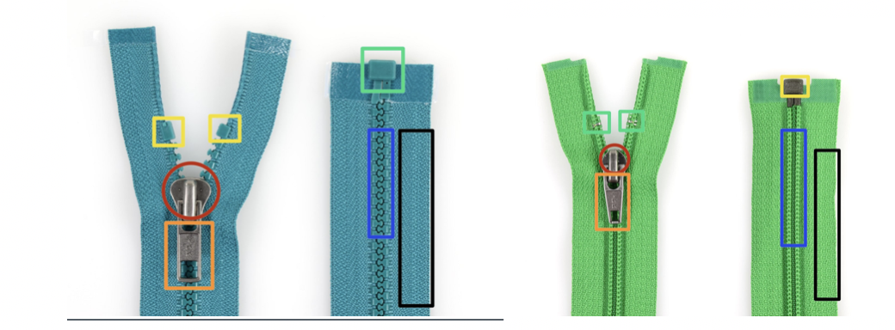

  <iframe width="800" height="400" src="https://www.youtube.com/embed/Rdfr1IYgkUA" frameborder="0" allow="accelerometer; autoplay; encrypted-media; gyroscope; picture-in-picture" allowfullscreen></iframe>

No matter how much you take care of your garments, they are there to be worn, so accidents can always happen. A small fix can create a new life for your garment. The act of repairing itself reminds us that making something takes time, that it’s worth mending for its value and for who made it. In this chapter we are going to show the basics of repairing, what techniques there are. How to choose the best technique, some examples and in the video we will repair a few things.

# Overview of our favorite techniques

| Repair|      Brief description   | Done by Hand or Machine | Used on Knits or Woven |
|--------------------|--------------------|--------------------|--------------------|
||    **Stitch Repair**     A quick and easy fix. But not very durable on places where a lot of friction of movement is happening.       |Hand + Machine| Knits + Woven |
||    **Patch Repair**   Very Durable repair. A piece of fabric that makes the rip or hole more durable by replacing or covering the worn out area.    |Hand + Machine|  Woven |
||    **Darning**   Decorative, but durable repair. A technique where a weaving is created over the rip on woven fabrics or in the hole on knits fabrics.   |Hand| Preferably Woven + Knits |
||    **Needle felting**   Quick fix for knits. A felted patch is created by placing wool fibres on top of the rip, the wool can be felted by needle felting needles.          |Hand | Knits |
||    **Edge mend**   Decorative repair. Covering the edge of a hole or a worn out fabric edge with the Buttonhole Stitch   |Hand| Thick Woven + Knits |
||    **Button Repair**   A flat button, jeans button, snap button or hook and eye fasteners that have been falling off and need to be placed back.  |Hand| Knits + Woven |
||    **Zipper Repair**   Zippers can be repaired different ways, depending what the issue is. |  Hand + Machine|   Knits + Woven |           

#   Stich Repair

(📸Photo of a stitch repair)

Depending on where the rip is, a stitch repair is recommended when placed in the middle of the fabric where not much tension is happening. so for instance not on the knees, elbows, shoulders, crotch or butt.



### By hand VS machine
(📸Split Photo of repair by hand and machine)

By hand the stitch repair can be done with the Ladder Stitch for a bit of an invisible repair or when a seam is ripped or with an Overcast stitch for an visible repair.

By machine it is mainly done by a Zigzag stitch if it is placed in the middle of the fabric. Or with a straight stitch when a seam is ripped open.

#   Patch Repair
(📸Photo of a Patch repair)

A patch is a piece of fabric you can place over a rip or hole. This is necessary on places on the garment where there is movement and friction going on like the knees, elbow, crotch or butt and therefore needs a bit more strength.  


### Making a patch
(📸Photo of a Patches)

Our favourite way of patching is making our own patch of fabric scraps or left overs from other sewing projects. Keep a box for leftover fabrics, as this you can always keep for filling material or patches. There are only a few things to consider of what fabric is best to use as patch material.

### Tips for patching
1. Every patch you add affects the garment. It is best to choose a patch material that is of similar weight and characteristics of the garment you are repairing, especially when repairing a lightweight garment. This way the fit and comfort of the garment remains the same. For instance, when patching jeans, a piece of similarly strong and durable fabric, like a canvas or denim is perfect. If you repair it with a light weight fabric it easily rips the next day again.

2. The best suitable patching material also depends on the location of the rip. For instance, if the rip is located where there is a lot of movement or friction and has a higher chance of ripping or fraying, your patch fabric should be strong to combat this.

3. When cutting a patch, it needs to be 2 to 3 cm bigger on both sides of the rip. If the whole area around the rip is quite thin and worn out then cut the patch, 2 to 3 cm around the worn out area, to avoid ripping above the patch. Check in the video how to patch it and do it by machine with Zigzag patch or by hand with the Sashiko technique.

#  Darning
(📸Photo of a few darnings)

Darning is a repair technique where you create a woven patch over the hole or in the hole.
In the Basics we discuss what a weaving is and how it is made. To bring your darning work to a next level is knowing what kind of weaving pattern you can use. In the video we do the most basic weave, called a plain weave. Which is a good one to start with. The more advanced you get, the more you can vary with weaving patterns. If the hole is in a jeans for instance it is nice to repair it with a twill weave, that matches the original weave. Or you can replace it with a totally different weave and go wild with a herringbone or a diamond weave.
(📸Image of wefts)

#  Needle Felting
(📸Photo of needle felting)

Needle felting can be a good repair technique when having a hole in a knitted garment or a thicker woven or felted garment. Because wool has these amazing fibre hairs that intersect with each other, with friction and/or heat felt can be created. Therefore you need hot water or just very simple needle punch needles. These needles have intersected hooks, that when you punch through the wool fibres, the fibres will stick together and become felt.

#  Edge Mend
(📸Photo of Edge mend (saying 1cm of the edge)

With the Edge Mend you leave the hole as it is and finish off the edges so it doesn’t raffle any further. Or you use the edge mend for a fraying edge of the sleeve or fraying collar. We recommend doing this with a wide Buttonhole/Blanket Stitch for more strength. You can find this stitch step by step in the Basics, preferably not too tight or too close to the edges, like a distance from 0,5mm to 1cm off from the edge. Like above.


#  Button Repair
To know how to put back on your button. You need what kind of button you had.
Here is a quick rundown of the main ones. In the video we will show how to fix a flat button and jeans button.

|  | Type | Found in|
|-------------|---------------|-------------|
| 📸|**Flat button**   The normal buttons we all know. They have 4 holes or 2 holes, which you can sew on by hand or by machine. If you do it too tight the thread will break again the next day. There needs to fit a fabric layer in between. | Jackets+ blouses + Pyamas |
| 📸|**Shank Buttons**   Shank buttons have a loop under the button itself, this is in a way the space you create with a flat button by placing the match under the button, only this one has one already itself. This one is for thicker coats and jackets, place it on the place where you want to have it and attach it with the overcast stitch, by stitching over the loop. |Coats + thicker fabrics|
|📸|**Jeans Button**   All jeanswear have these. The button has a nail where you pin or slam the button in and can hold thick layers of denim. |Jeanswear|
|📸|**Snap Button**   The process looks a bit like placing a jeans button. With this one there is no sewing involved, you need to slam in with a hammer.| ???|
|📸|**Hook and Eye Fasteners**  This is not very common anymore, but you can still see it in luxury women's wear. Mainly it is done with the overcast stitch by stitching over the loops.|Bra + lingerie|

#  Zipper Repair

A zipper repair requires more sewing skills, you can try it out yourself but then you do need some patience before you want to throw your sewing machine out of the window.
Next to that you will need a zipper foot with your sewing machine, unless you want to do it by hand.  We would like to eventually provide a full video ourselves on zippers. But that needs a full video of itself as there are different zippers, different situations on how your zipper is broken and different ways to replace a zipper depending where it is placed in. For instance a jeans needs a different way of zipper replacement than jackets. In the video we  talk about the different zippers out there and the different situations where you don’t need to replace the full zipper and whenever you do need to replace it.

**Coil Zipper**
Is the most common and regular zippers of all, it is also named the all-purpose zipper. The coil zipper is a nylon based zipper and has a stitch line over the zip teeth/chain. From this zipper we have three versions. Good to use for skirts, blouses, shirts and dresses.

**Metal Zippers**
Are easily recognised by their metal teeth made from aluminium, nickel or brass. Both of these zipper options are very sturdy and do well when using heavier material
You can find them a lot in jeans and jeanswear or more heavy wear clothing.  

**Vislon Zippers**
Are the zippers that are plastic molded on to the zipper lint and do well when using heavier material. The plastic ones are more for Jackets, Sweatshirts/hoodies, Sweaters, Coats and Parkas..

### DONT replace the zipper if


- The zipper doesn’t run smoothly, use a pencil and mark it over the zipper. The grafite will help the zipper to run the zipper smoothly. If not you can always buy zipper oil which you will run the zipper smoothly with.

- The zipper doesn’t close behind the slide and it opens up again, it's mainly because the slider is worn out or bent.
- There are teeth out of a metal zipper, most of the time this happens in jeans. If this happened close to the bottom or top of the zipper chain, you can move the top or bottom by replacing the stop or the box. Unless the teeth are missing in the middle of the zipper, then I would recommend replacing the whole zipper. You can try to replace the top or bottom, but it might be that you won’t fit your jeans anymore or the zipper will be too far open to call it a functional closure.

### Replace the zipper if

- The lint next to the teeth/rails is ripped or broken

- When the stitch of Coil Zipper is damaged and unravels from the teeth/chain

- When a few teeth of a Vislon zipper is/are melted or missing
- When the box or the stops are broken or the end of the zipper is not finished as it should be

- When the metal teeth are missing on a place in the middle of the zipper,  where you can’t replace the bottom or replace the top, cause it will lose the function of the zipper.

### Components of a zipper.
Sometimes there is no need to replace the entire zipper, but perhaps just a part is broken. We show a few examples below. In this case it's useful to understand the components in zipper and what to replace. Below you can see the parts.

