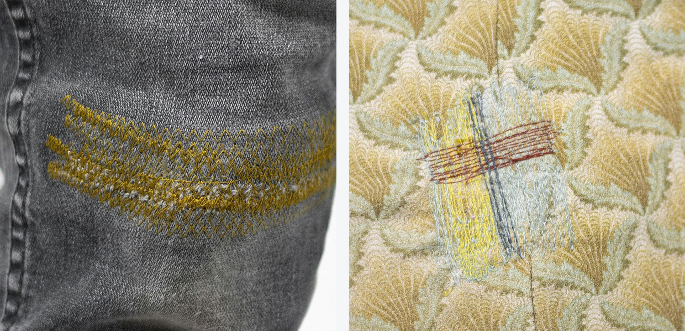
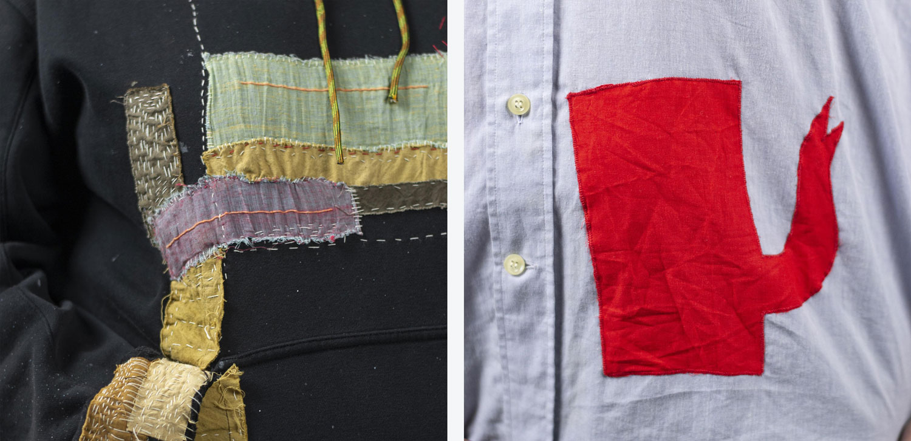
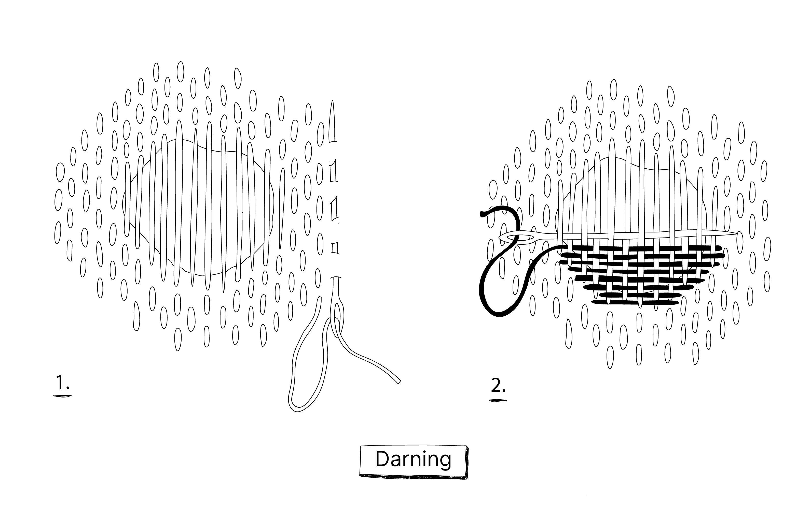
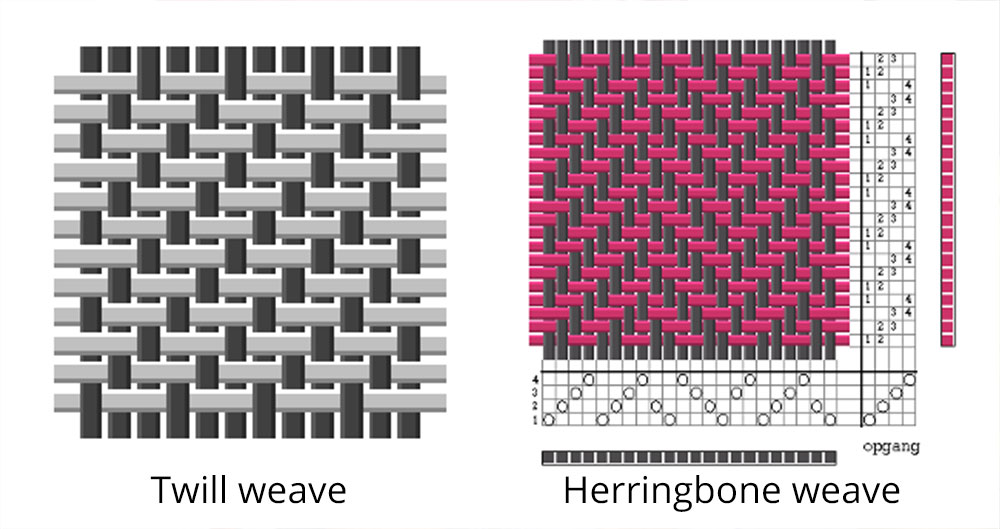
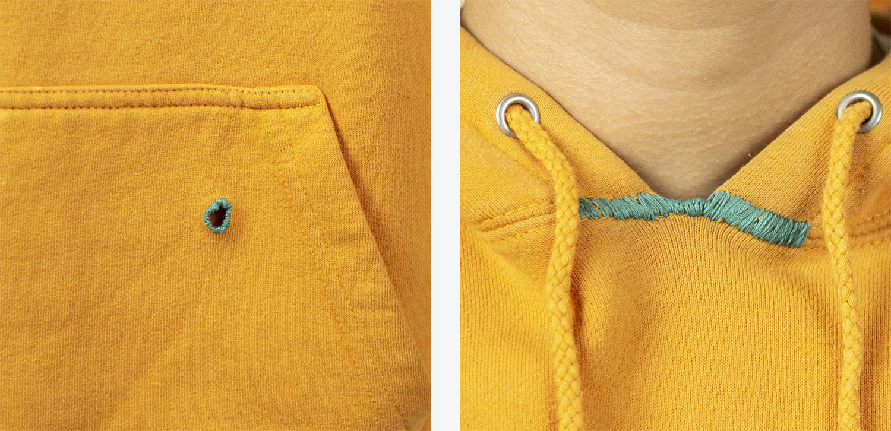
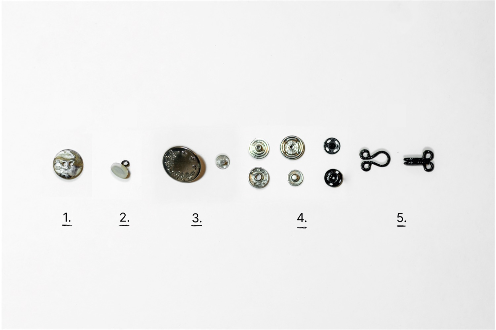
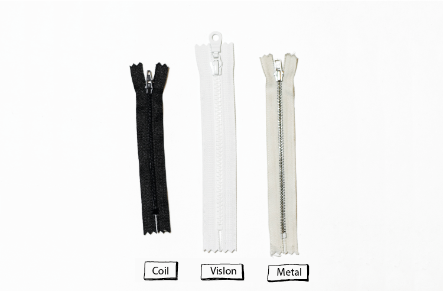
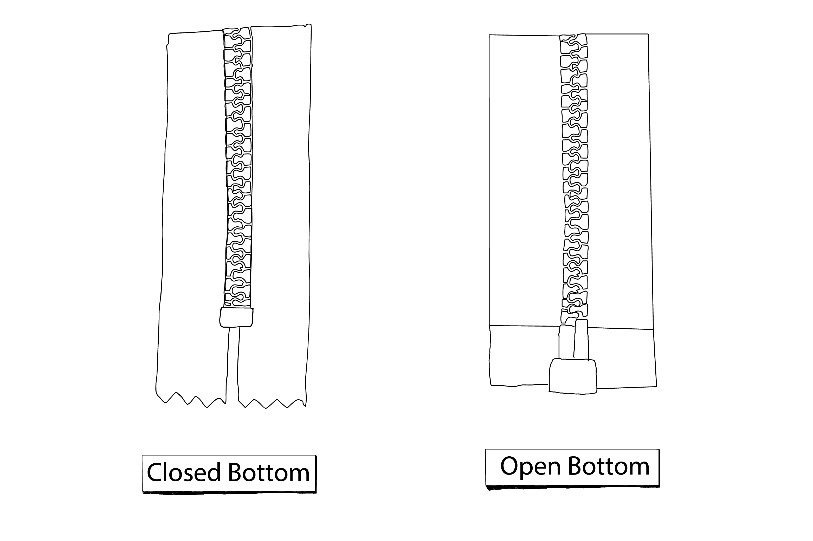

  <iframe width="800" height="400" src="https://www.youtube.com/embed/x5lcUh7Svgo" frameborder="0" allow="accelerometer; autoplay; encrypted-media; gyroscope; picture-in-picture" allowfullscreen></iframe>

No matter how much you take care of your garments, they are there to be worn, so accidents can always happen. A small fix can create a new life for your garment. The act of repairing itself reminds us that making something takes time, that it’s worth mending for its value and for who made it. In this chapter we are going to show the basics of repairing, what techniques there are. How to choose the best technique, some examples and in the video we will repair a few things.

# Overview of our favorite techniques

| Repair|      Brief description   | Done by Hand or Machine | Used on Knits or Woven |
|--------------------|--------------------|--------------------|--------------------|
||    **Stitch Repair**     A quick and easy fix by hand or by machine. Not very durable in places where there is a lot of friction and movement.        |Hand + Machine| Knits + Woven |
||    **Patch Repair**   Very Durable repair. A piece of fabric that makes the rip or hole more durable by replacing or covering the worn out area.     |Hand + Machine|  Woven |
||    **Darning**   Decorative, but durable repair. A technique where a weave is created over the rip on woven fabrics or in the hole on knitted fabrics. By creating a warp as base and a weft to close the hole.   |Hand| Preferably Woven + Knits |
||    **Needle felting**   Quick fix for knits. A felted patch is created by placing wool fibres on top of the rip, the wool can be felted by needle felting needles.          |Hand | Knits |
||    **Edge mend**   Decorative repair. Covering the edge of a hole or a worn out fabric edge with the Buttonhole Stitch.   |Hand| Thick Woven + Knits |
||    **Button Repair**   A flat button, jeans button, snap button or hook and eye fasteners that have fallen off and need to be replaced.  |Hand| Knits + Woven |
||    **Zipper Repair**   Zippers can be repaired different ways, depending what the matter is.  |  Hand + Machine|   Knits + Woven |           

#   Stich Repair

Depending on where the rip is, a stitch repair is recommended in the centre of the fabric. It is not suitable for rips in places where there is a lot of friction (ie. knees, elbows, shoulders, crotch or butt).



### By hand VS machine
By hand, the stitch repair can be done with the Ladder Stitch for an invisible repair or when a seam is ripped. If you want a visible repair, use the Overcast Stitch.
By machine, the Zigzag stitch is commonly used if the rip is in the middle of the fabric. A straight stitch is perfect for a ripped open seam. You can find the Stitches in the Academy here and here. If it is placed in the middle of the fabric. Or with a straight stitch when a seam is ripped open.

#   Patch Repair

A patch is a piece of fabric you can place over a rip or hole. This is necessary on places on the garment where there is movement and friction going on like the knees, elbow, crotch or butt and therefore needs a bit more strength.  


### Making a patch
Our favourite way of patching is making a patch out of fabric scraps or leftovers from other sewing projects. Keep a box of leftover fabrics as you can always reuse them for filling material or patches. There are only a few things to consider when selecting your patch material.

### Tips for patching
1. Every patch you add affects the garment. It is best to choose a patch material that is similar to the weight and characteristics of the garment you are repairing, especially when repairing a lightweight garment. This way the fit and comfort of the garment remains the same. For instance, when patching jeans, a piece of similarly strong and durable fabric, like canvas or denim is perfect. If you repair it with a lightweight fabric it can easily rip the next day again.
2. The best suitable patching material also depends on the location of the rip. For instance, if the rip is located where there is a lot of movement or friction and has a higher chance of ripping or fraying, your patch fabric should be strong to combat this.
3. When cutting a patch, it needs to be 2 to 3 cm bigger on both sides of the rip. If the whole area around the rip is quite thin and worn out then cut the patch, 2 to 3 cm around the worn-out area, to avoid ripping above the patch. Check in the video how to patch it and do it by machine with a Zigzag patch or by hand with the Sashiko technique.

> Note: Original Sashiko thread is 100% cotton and it is going to shrink a little when washed. The texture of the thread is a sashiko aesthetic. If the stitch becomes too tight the fit and the design will change and can cause the yarn to snap. Plus the repair won't look nice.

In the video, we explain the Zigzag repair. A patch by Machine placed underneath and stitched with a zigzag stitch. This can also be done with a straight stitch but requires more stitching. The zigzag repair is a way of repairing jeans and workwear and only woven fabrics. The straight stitch patch can be used as a decorative repair and can be placed in a pattern as you see in the picture.

#  Darning
Darning is a repair technique where you create a woven patch over the hole or in the hole. In the Basics, we discuss what weaving is and how it is made. To bring your darning work to the next level you need to know what kind of weaving pattern you can use.

The more advanced you get, the more you can vary with weaving patterns. If the hole is in a pair of jeans it is nice to repair it with a twill weave, that matches the original weave. Or you can replace it with a different weave and go wild with a herringbone or a diamond weave. In the video, we do the most basic weave, called a plain weave. It is a great starting point.

If you want to bring your work to the next level. You can prepare cards with the coloured yarns you have and see what colour combination fits best with the colour of the garment. , This avoids working on a darning job where you are eventually not happy with it, because you chose the wrong colours.

#  Needle Felting
Needle felting can be a good repair technique when having a hole in a knitted garment or a thicker woven or felted garment. Because wool has these amazing fibre hairs that intersect with each other, adding friction and/or heat a felt can be created. Therefore, you need hot water or just very simple needle punch needles. These needles have intersected hooks, that when you punch through the wool fibres, the fibres will stick together and become felted.
These are the tools you need:

#  Edge Mend
With the Edge Mend, you leave the hole as it is and finish off the edges so it doesn’t unravel any further. Or you use the edge mend for a fraying edge of the sleeve or fraying collar. We recommend doing this with a wide Buttonhole/Blanket Stitch for more strength. You can find this stitch step by step in the Basics, preferably not too tight or too close to the edges. A distance of 0.5mm to 1cm from the edge. Like above.

#  Button Repair
To know how to put back on your button, you need to know what kind of button you have. Here is a quick rundown of the main ones. In the video, we will show how to fix a flat button and jeans button.

|  Type | Found in|
|-------------|-------------|
|**1. Flat button**   The normal buttons we all know. They have 4 holes or 2 holes, which you can sew on by hand or by machine. If you do it too tight the thread will break again the next day. There needs to fit a fabric layer in between.| Jackets + blouses + Pyjamas |
| **2. Shank Buttons**   Shank buttons have a loop under the button itself, this helps create the space needed to have the gap needed to fasten the button. These buttons are used for thicker coats and jackets. To attach it, place the button where you want to have it and sew it on with the overcast stitch, by stitching over the loop. |Coats + thicker fabrics|
|**3. Jeans Button**   All jeanswear have these. The button has a nail where you pin or slam the button in and can hold thick layers of denim. |Jeanswear|
|**4. Snap Button**   The process looks a bit like placing a jeans button on. With this button style, there is no sewing involved all you need is to slam in with a hammer.| Jackets +
Skirts|
|**5. Hook and Eye Fasteners**  These buttons are not very common anymore, but you can still see them on luxury women's wear. Mainly they are attached with the overcast stitch by stitching over the loops.|Bra + lingerie|

#  Zipper Repair

A zipper repair requires more sewing skills. You can try it out yourself, but you will need some patience. It can be tedious and you may want to throw your sewing machine out of the window when you are done. You will also need a zipper foot for your sewing machine unless you want to do it by hand. We would like to eventually provide a full video ourselves on zippers, but that needs a full video in itself. It is a big topic as there are many different zippers, ways to attach them and ways they could break. For instance, jeans need a different way of zipper replacement than jackets. In the video, we talk about the different zippers out there and the different situations where you do and don't need to replace the full zipper.

**The Coil Zipper** is the most common and regular zipper of all, it is also named the all-purpose zipper. The coil zipper is nylon-based and has a stitch line over the zip teeth/chain. From this zipper, we have three versions. Good to use for skirts, blouses, shirts and dresses.

**Metal Zippers** are easily recognised by their metal teeth made from aluminium, nickel or brass. Both of these zipper options are very sturdy and do well when using heavier material. You can find them a lot in jeans and jeanswear or more heavy wear clothing.

**Vislon Zippers** are the plastic moulded on to the zipper lint and do well when using heavier material. The plastic ones are more for Jackets, Sweatshirts/hoodies, Sweaters, Coats and Parkas.

### DONT replace the zipper if

- The zipper doesn’t run smoothly, use a pencil and mark it over the zipper. The graphite will help the zipper to run smoothly. If not you can always buy zipper oil which will help the zipper run smoothly.
- The zipper doesn’t close behind the slide and it opens up again, it's mainly because the slider is worn out or bent.
- There are teeth out of a metal zipper, most of the time this happens in jeans. If this happens close to the bottom or top of the zipper chain, move the top or bottom by replacing the stop or the box. Unless the teeth are missing in the middle of the zipper, then I would recommend replacing the whole zipper. You can try to replace the top or bottom, but it might be that your jeans won't fit anymore or the zipper will be too far open to call it a functional closure.

### Replace the zipper if
- The lint next to the teeth/rails is ripped or broken
- When the stitch of Coil Zipper is damaged and unravels from the teeth/chain
- When a few teeth of a Vislon zipper are melted or missing
- When the box or the stops are broken or the end of the zipper is not finishing where it should be
- When the metal teeth are missing on a place in the middle of the zipper, where you can’t replace the bottom or the top, because it will lose the function of the zipper.

### Components of a zipper.
Sometimes there is no need to replace the entire zipper, but perhaps just a part is broken. We show a few examples below. In this case, it's useful to understand the components in the zipper and what to replace. Below you can see the parts. If you replace a zipper and you know how to do it, be aware that you need to have the right zipper length, not the zipper lint length. And that you have Close-ended zippers and Open-ended zippers. If the zipper is used for a bag it needs a Close-ended Zipper that has a closed stop box or no finish at all. With a closed stop box, the zipper ends to that point and can’t be separated. Open-ended Zippers are more used in jackets or other garments where you need to go in and out of and where the slider can come off the rails and back on.

