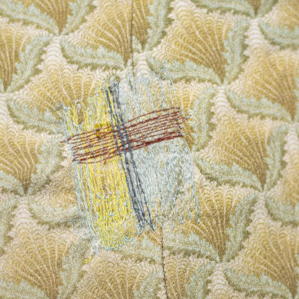
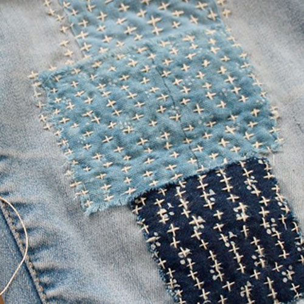
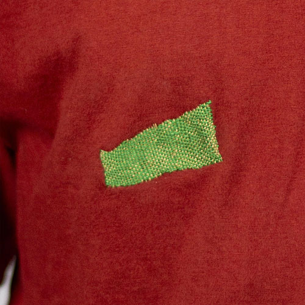
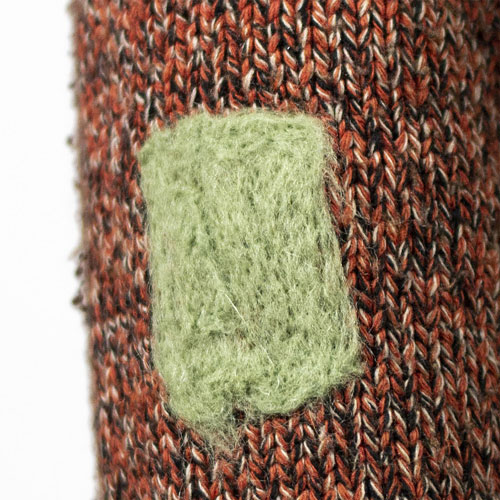
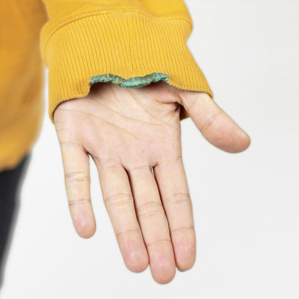
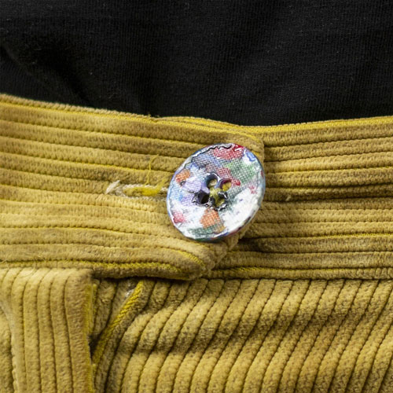
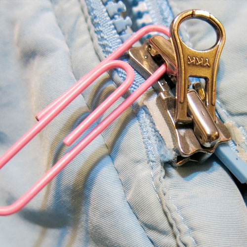

  <iframe width="800" height="400" src="https://www.youtube.com/embed/TnxGHRlevlQ" frameborder="0" allow="accelerometer; autoplay; encrypted-media; gyroscope; picture-in-picture" allowfullscreen></iframe>

No matter how much you take care of your garments, they are there to be worn, so accidents can always happen. A small fix can create a new life for your garment. The act of repairing itself reminds us that making something takes time, that it’s worth mending for its value and for who made it. In this chapter we are going to show the basics of repairing, what techniques there are, how to choose the best technique, some examples and in the video we will repair a few things.

> Note: This is our first version of the Fixing Fashion Academy. We have many more topics and techniques to document, it will grow overtime. If you want to support us make sure to join [Patreon](https://www.patreon.com/one_army).

# Overview of our favorite techniques

| Repair|      Brief description   | Done by Hand or Machine | Used on Knits or Woven |
|--------------------|--------------------|--------------------|--------------------|
||    **Stitch Repair**     A quick and easy fix by hand or by machine. Not very durable in places where there is a lot of friction and movement.        |Hand + Machine| Knits + Woven |
||    **Patch Repair**   Very Durable repair. A piece of fabric that makes the rip or hole more durable by replacing or covering the worn out area.     |Hand + Machine|  Woven |
||    **Darning**   Decorative, but durable repair. A technique where a weave is created over the rip on woven fabrics or in the hole on knitted fabrics. By creating a warp as base and a weft to close the hole.   |Hand| Preferably Woven + Knits |
||    **Needle felting**   Quick fix for knits. A felted patch is created by placing wool fibres on top of the rip, the wool can be felted by needle felting needles.          |Hand | Knits |
||    **Edge mend**   Decorative repair. Covering the edge of a hole or a worn out fabric edge with the Buttonhole Stitch.   |Hand| Thick Woven + Knits |
||    **Button Repair**   A flat button, jeans button, snap button or hook and eye fasteners that have fallen off and need to be replaced.  |Hand| Knits + Woven |
||    **Zipper Repair**   Zippers can be repaired different ways, depending what the matter is.  |  Hand + Machine|   Knits + Woven |           

**If you have any questions about this topic sure to visit our [community chat](https://discord.com/invite/SSBrzeR) on Discord. Many skilled and likeminded people are in there :)**
