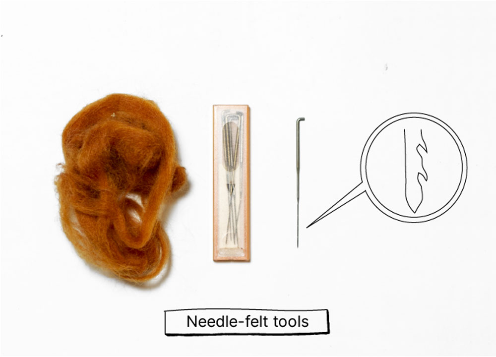

  <iframe width="800" height="400" src="https://www.youtube.com/embed/Zav6cz1m_F8" frameborder="0" allow="accelerometer; autoplay; encrypted-media; gyroscope; picture-in-picture" allowfullscreen></iframe>

#  Needle Felting
Needle felting can be a good repair technique when having a hole in a knitted garment or a thicker woven or felted garment. Because wool has these amazing fibre hairs that intersect with each other, adding friction and/or heat can create a felt. Therefore, you need hot water or just very simple needle punch needles. These needles have intersected hooks, that when you punch through the wool fibres, the fibres will stick together and become felted.
These are the tools you need:

**If you have any questions about this topic sure to visit our [community chat](https://discord.com/invite/SSBrzeR) on Discord. Many skilled and likeminded people are in there :)**
