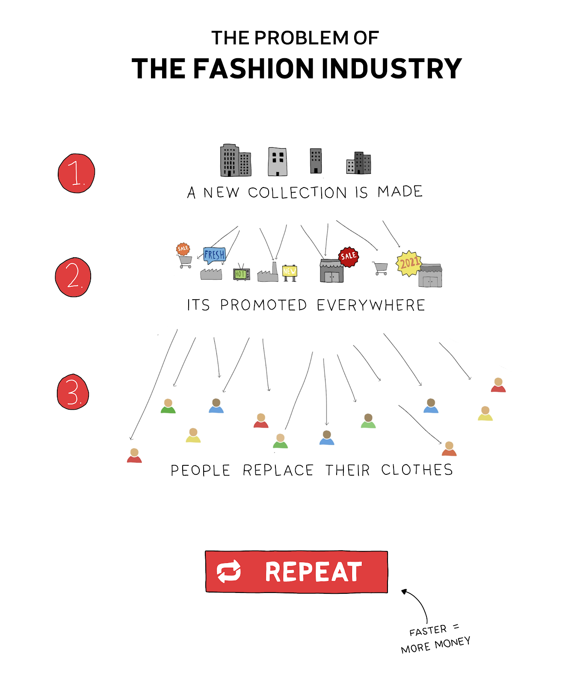

For several years the fashion industry has been under fire for the problems they create. Exploiting workers, sweatshops, overproduction, pushing consumption, polluting rivers etc. How is this still happening these days, why isn’t this fixed? Well the fashion industry is complex, it has a global supply chain and is trend related. This is a model for income for many busniness around the world. There is a constant push for new clothes and collections. But let's dive into it step by step, starting with the production.

### 🏭 Producing clothes
Production of our clothes happens most of the time in developing countries. Wages are low, material costs less and there are fewer regulations. Lax regulations translate into many cases of water pollution, environmental degradation, exploitation and unhealthy working conditions. Damaging the local environment and the people working in the industry. The main reason for all of this is simply that it’s cheaper. It makes it possible to produce clothes for a fraction of what it would cost in a developed country. It is cheaper to produce clothes on the other side of the world, ship it in a boat and move it in trucks than producing locally in developed countries.

### 👕 Consuming clothes
After clothes are produced and shipped to stores and warehouses in developed countries they need to be sold. Selling clothes = money. So companies want us to buy more clothes. They do this by creating new collections and bombarding us with ads. A new collection makes the previous collection “out of fashion”. Before collections (haute-couture) were created once a year, then 4 times a year (each season) and nowadays 7 times a year. Some brands even bring out 52 collections a year (weekly!). This is known as fast fashion. They create new trends, make amazing campaigns, hire top actors/influencers/models each time, to make you buy more clothes. As a result, people don't replace clothes because they are broken, don't function anymore, or because they have gotten much better. They replace them because they look old fashioned.

### 🗑 Disposing clothes
These new collections mean we replace our clothes regularly for new ones that look more trendy. They go out the door when they still function properly, there is nothing really wrong with them. Nowadays you can find many “Clothing Donation Boxes”. Places where you can dispose of your unwanted clothes in a container for goodwill to get recycled or reused. But is it really? Let's have a look at those two options.

- **Reusing clothes -** This is a great option to increase their lifespan. But many second hand stores in the developed world have a surplus of clothes, they get more in than they can sell. Incoming clothes get filtered: good quality is kept, lower qualities are sold back to developing countries (like Ghana and India) where they are distributed on local markets. Our donating resembles more an act of dumping unwanted materials (like plastic), as a consequence local industries fade away making it difficult to develop an independent local economy. Simply because very few on the other side of the planet make a profit out of this dynamic.

- **Recyling -** The harsh reality is that very little of our clothes get recycled, mainly because they are all made from different materials. Polyester, Cotton, Viscose, Wool etc. and everything gets thrown out mixed together. From shirts to underwear and pyjamas. On top of that within one single piece of clothing often different materials are used. For instance, a shirt can be a mix of 80% cotton, 10% Polyester and 10% Viscose. This makes recycling very hard and complicated.

### 📈 The core of the problem
The three realities above give an overview of the cycles of our clothes. There are clearly many things to improve, like making the production more sustainable, or making sure we can recycle them better. And these are important topics companies work on (or at least should). Releasing a new collection that is organic, or made fairtrade.

However, fashion brands won't tackle the fundamental root problem. At the end of the day they want to sell you something. They continue to fuel the engine of “producing more clothes”. Clothes that weren’t needed in the first place. We don’t need more new clothes, at the moment the world has enough clothes for the coming decade. In shops, warehouses, outlets and our own wardrobes. It’s time to keep those valuable clothes longer, reuse them and take proper care of them. But this change isn’t going to come from the fashion industry. They are not going to promote this on billboards and advertisements. It has to come from the people. From you and me.

### 💫 Solutions
The cool thing about fashion is that it can change. It's made by humans. The clothes we used to like 20 years ago now look silly, and if you look at the latest fashion show it's hard to imagine you would ever wear that. But you will. Companies fuel these trends and promote them. But just like companies fuel new trends, we can do it as well.  A trend for repairing, caring and upgrading clothes. Keeping them longer. So unlike companies, we don’t want to sell you anything. We want the opposite. We might not have the budget to hire top notch actors, or billboards. But we can have people support. Nowadays everyone has a platform and can reach people with their social media. Share and inspire others to upgrade and repair clothes. Use your platform and spread this new trend.

# Want to dive deeper?

If you want to dive deeper into topics around the fashion industry and its complexity. These researchers, writers and changemakers are good ones to follow. We hope these sources only support you to do more, instead of overwhelm you. It’s a learning process and we love to learn from you as well and have more conversations on our [Discord](https://discord.com/invite/SSBrzeR).

### **This is not your goldmine. This is our mess.**
[The OR Foundation](https://www.instagram.com/theorispresent/): About their research around Kantamanto market and about why a circular economy is more than needed. Follow their Instagram for more information about their work.

[↩️ Read](https://atmos.earth/fashion-clothing-waste-letter-ghana/)
  

### **Dead white man’s clothes Atmos article**
[The OR Foundation](https://www.instagram.com/theorispresent/): About their relationship with Abena, working as a kayayo (a Headporter) in Kantamanto and shares her story.

[↩️ Read](https://atmos.earth/ghana-kantamanto-clothing-waste-problem/)
  

### **Conscious ethical and cruelty free; a guide to the language of sustainable fashion**
[Aja Barber](https://www.instagram.com/ajabarber/): About how complex our choices on choosing sustainable clothing have become and some guidance with it.  

[↩️ Read](https://www.theguardian.com/fashion/2019/dec/19/conscious-ethical-and-cruelty-free-a-guide-to-the-language-of-sustainable-fashion)
  

### **What can our sweaters teach us about politics**
[Céline Semaan ](https://www.instagram.com/celinecelines/): How knowledge around your garment can overwhelm you, but hopefully empowers you to act.

[↩️ Read](https://www.ripostemagazine.com/celine-semaan_materials)
  

### **Slow Factory: Fashion and…**
[Slow Factory ](https://www.instagram.com/theslowfactory/): Slow Factory is an open source learning platform with amazing people from different backgrounds lecturing on several topics around the fashion industry.

[↩️ Read](https://slowfactory.foundation/open-education)
  

### **State of Fashion Long read**
[Sandra Niessen](http://bataktextiles.blogspot.com/): About how smaller cultures and smaller fashion industries get taking over by one dominant industry and its effects (article + video/interview)

[↩️ Read](https://www.stateoffashion.org/en/intervention/intervention-1-introspection/long-read-titel/) &
[↩️ Read even more ](https://www.stateoffashion.org/en/intervention/intervention-1-introspection/rewatch-whataboutery-1-regenerative-fashion-there-can-be-no-other/)
  

### **Fashion brands are today's colonial masters**
[Aditi Mayer](https://www.instagram.com/aditimayer/): About how COVID showed us again the cracks in the fast fashion industry and the relations between the Global North and South

[↩️ Read](https://www.adimay.com/2020/08/fashion-brands-are-todays-colonial-masters/)
  

### **State of Fashion Long read**
[Aditi Mayer](https://www.instagram.com/aditimayer/): About what happens and what happened to Indian (cotton) farmers and their environment (article + video/interview)

[↩️ Read](https://www.stateoffashion.org/en/intervention/intervention-2-origins/longread-2-aditi-mayer/) &
[↩️ Read even more](https://www.stateoffashion.org/en/intervention/intervention-2-origins/whataboutery-02-indias-decolonial-approaches-to-land-labour-and-the-fashion-industry/)
  

### Fashion Revolution
Activism platform that creates awareness around the sources, the makers and the afterlife of clothing and demands to act towards brands.

[↩️ Read](https://www.fashionrevolution.org/ )

**If you have any questions about this topic or have something to discuss make sure to visit our [community chat](https://discord.com/invite/SSBrzeR) on Discord. Many skilled and likeminded people are in there :)**
