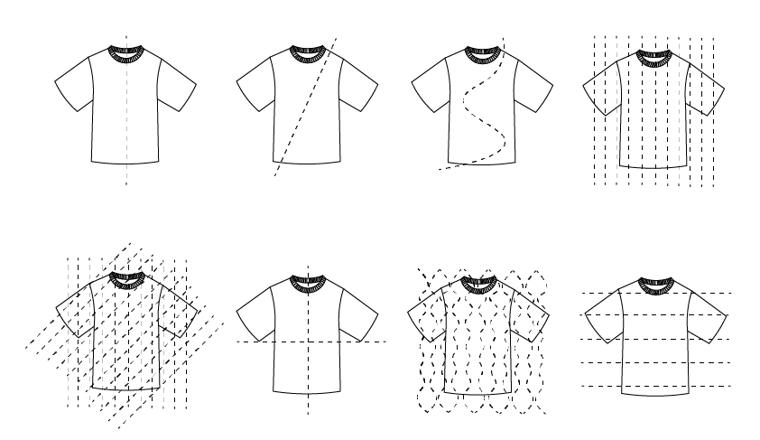
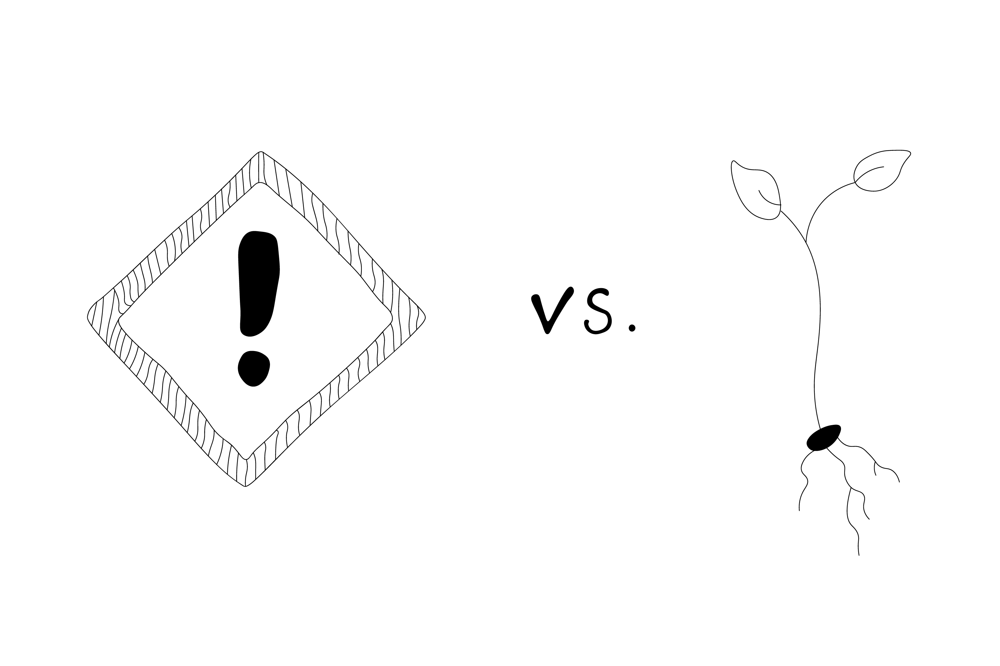
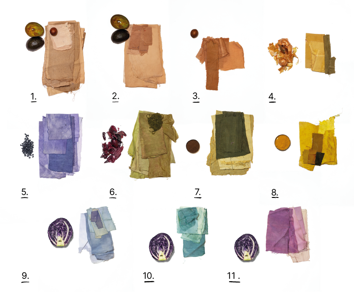
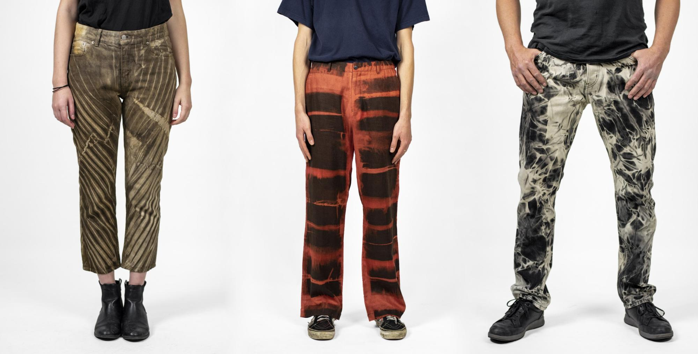
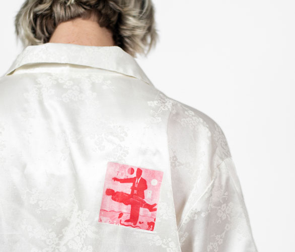
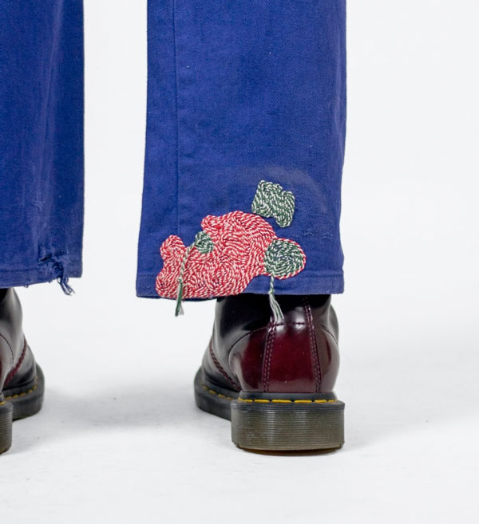

  <iframe width="800" height="400" src="https://www.youtube.com/embed/IO9VlYliXcU" frameborder="0" allow="accelerometer; autoplay; encrypted-media; gyroscope; picture-in-picture" allowfullscreen></iframe>

Even after a lot of caring and repairing, sometimes your clothes just need a bigger upgrade. Stains or rips could be too big to fix or you want to change up your style. The garment can still be used, so don't throw it out! There is a stage between recycling or swapping it. Of course, repairing the issue is the first step, but you can do a few more things before saying goodbye to it. Time to upgrade! You can Resize, Remake, Recolour or Decorate your clothes to give them a new and fresh look. We will break everything down further in these exact sections.

> Note: This is our first version of the Academy. We have many more topics and techniques document, it will grow overtime. If you want to support us make sure to join [Patreon](https://www.patreon.com/one_army).

# Techniques
| Upgrade  |Description  |
|--------------------|--------------------|
||    **Resize**     How to change the fit by making one garment smaller or bigger, shorter or longer.      |
||    **Remake**   Two or more garments combine to make a new garment, with either the same function or a totally different one. From three shirts to one or from two shirts to a dress.      |
||    **Recolor**   Give a garment a new colour or bring it back to a more intense color, with a chemical dye or natural dye; that can be plant based or food based like leftovers of vegetables.    |
||    **Decorate**   Quick takes to change the look of your garment by using; Prints (think Bleach, Tie-dye, Shibori etc.), Markers, Embroidery and Needle Felting    |

#  Resize
Resizing your garment is an incredibly useful skill. If you know how to do this, you can make anything your size, even your mum or dad's funky '60s clothes. So welcome to ‘Resizing’: the skill that makes everything wearable.

Resizing a garment can be understood in many ways: making it shorter, longer, smaller or bigger and then doing that visibly or invisibly. Good ways to finish a garment when you make it shorter or longer, depends on what kind of clothing it is and what fabric it is made of.

#  Remake
Remaking your clothes gives you the power to not throw away your full garment. With Remake, you can cut out the parts that you still like and use them to create a whole new garment.
A few things you need to keep an eye on when you want to Remake
- It is easier to combine clothing from the same size. One size difference is still okay to work with. But if you work with an XS and XL, you need to think about the fit that is drastically going to change.
- Clothing preferably is a size bigger than you wear as you take out 0.5cm to 1cm at every seam you draw.
- Always make sure to start pinning your new patterns from the top if one garment is longer than the other one.
- There are multiple varieties of combining clothing. The more complex your remake, the longer it takes to fully combine the garment and the smaller the shirt becomes.

A popular way to remake is to combine 2 pieces of clothes. Changing the function of the garment by adding something to it also falls under Remake. Adding functionality can mean that you add something to the garment that has a function, like pockets, a pencil holder or a loop to hook your keys on like we did in the video.

#  Recolor

Sometimes in the laundry, the colour, blacks or whites can fade out and lose its brightness or colour depth. As you may have seen in the Care video this can be the result of mixing wrong colours, sweating or wearing it out. If the Care methods don't work you can dye your clothing Chemically or Naturally, both with their ups and downsides. It depends on your needs and what the best options are.

### Natural VS Chemical Dyeing

| Natural Dying | Chemical Dying |
|---------------|---------------|
|🟢 More ecological option  | 🔴 Consist of heavy toxic chemicals |
|🟢 Dye can be disposed in sink or on acid loving plants.| 🔴 Pollutes water.|
|🟢 Beautiful ancient craft|  🔴 Mwa..|
|🟢 Insane the colour plants and food waste can give.| 🔴 Usually made from oil|
|🟢 Friendly   | 🔴 Might cause skin irritation on sensitive skins |
|🔴 Takes way more time | 🟢 Fast and easy way   |
|🔴 Hard to replicate colors |  🟢 Stable outcome  |
|🔴 Quite experimental. | 🟢 Not much preparing needed, just go |
|🔴 Can only be done by hand | 🟢 Possible by hand and machine |
|🔴 Has no effects on Synthetic fibres | 🟢Tends to stick to more fibres |

As you can see both have their ups and downsides. It depends on your situation and time what makes most sense. The topi Note: Never mix the tools you use for dyeing with cooking tools. Even when you use Natural Dye as the plants or pretreating ingredients can be toxic and may contain high amounts of metal and are harmful for the ingestion. So keep them separate.

### Overview of steps for Dyeing
Chemical dyeing is mostly used in the washing machine. Make sure to read the instructions of your packaging thoroughly to get the ultimate results. Natural dyeing is shown briefly in the video and has quite a few steps. Below is the overview explaining the process.  Let us know in Discord if you want an in-depth video about this topic!

1. **Figure out the fibre of your clothes:** **🐑 Animal-Based types** - Are more sensitive to heat and need extra care and attention when preparing the fibre and throughout dyeing. Doing this will give you the most vibrancy. Give it plenty of time in the pot to allow the dye to bite the fabric.
**🌱 Plant-based types** - Are more robust and can withstand high temperatures and a lot more vigorous processing. That’s why we would recommend beginners to try out Natural dyeing with plant-based clothes first. The colours can vary a lot on how you prepare the garment, for instance with or without mordant. But the colours will always be more faded and duskier looking than the animal-based fibres.
**🛢 Synthetics** - We don’t recommend it as it gives no results.
2. **Choose a colour** that works on your Fibre (avocado, acorns, flowers, turmeric etc.)
3. **Scour your fabric** This removes residual starch, natural oils or sweat, which is needed to create an even dye. We will make a separate video eventually for this step by step, but a good source is: https://botanicalcolors.com/how-to-scour/ Be aware that both fibres will shrink with an average of 10%, so we won’t recommend doing this with a garment that fits perfectly to the body as it may not fit properly afterwards.
4. **Mordant your fabric** This helps the dye bite into the fabric for long-lasting colour, that is lightfast and wash fast. Lightfast doesn’t fade in the sun and wash fast doesn’t fade in water. We will make a separate video eventually for this, but a good source for this that explains it step by step is: https://botanicalcolors.com/how-to-mordant/
5. **Soak your fabric** first in water so the dye will go in evenly.
6. **Prepare a dye vat** (a place to soak and boil your clothes).
7. **Color :)**

👆 Above a few examples of where we colored with
1. Avocado (Skins + Nuts)
2. Avocado (Skins)
3. Avocado (Nuts)
4. Yellow Onions Skins
5. Black Beans (Residue water of soaking beans)
6. Red Onion Peels
7. Coffee + Rust water/ Acorns + Rust water
8. Turmeric
9. Red Cabbage
10. Red Cabbage with Baking soda
11. Red Cabbage with Lemon
But also Camomille, Hibiscus, Oxidized Copper, Pomegranate, Carrots and Beetroots. All of them are favourites, besides Beetroot, Carrot, Nettle and Red cabbage as the dye molecules don't bind with the fabric even with a mordant.

#  Decorate
Decorating is exactly how it sounds: applying small techniques to change the look of the garment. You can apply these techniques as a way of repairing or covering a stain. All of them are a good way to extend the lifetime of your garment and can be personalised. Decorating can be:
- Color them with a new print
- Give them a drawing with textile markers or brush strokes
- Add embroidery stitches
- Print something on top with transfer paper
- Use sewing machine stitches to create a drawing and much more

### A few decorative techniques we like

**Shibori & Tie Dye:** Shibori & Tie Dye:
Instead of fully dyeing your garments, you can use your dye for making prints. This can be done by using the dye options we showed you before, with Shibori techniques or Tie Dye techniques. Both techniques give an interesting print. Shibori is an ancient traditional Japanese technique and later on an African technique, created by folding and clamping two planks in any shape onto the folded fabric or garment but can give different prints by knotting, wrapping and tying. The way you fold, wrap or tie it and the shape you clamp it with, creates different kinds of prints.

Tie-dye: This is derived from the Shibori in the US in the '60s and is a more straightforward and simple technique of twisting and tying. This can be done with Bleach on darker clothes, as a replacement for dye. We know bleach is harmful to the environment, but throwing away a garment still weighs heavier than bleach. Besides this is the only way to give a faded dark coloured shirt a new purpose by changing in colour or print. For your Bleach dye, you will need ⅙ of bleach to ⅚ of water. We used 500 ml of bleach and 2.5l of water. This was enough to bleach jeans. Now there are ways to do it naturally with a lot of sun and lemon. But this will take a lot of time as you need to leave it for months to see some result. Always use gloves and wear an apron or work clothes, that you don’t mind getting stained.

Bleach: Using bleach as a replacement for dye is great with techniques like Shibori and Tie-Dye. We know bleach is harmful for the environment, but throwing a garment still weighs heavier than bleach.  Besides this is the only way to give a faded dark coloured shirt a repurposed by changing in colour or print. For your Bleach dye, you will need ⅙ of bleach to ⅚ of water; we used 500 ml of bleach and 2,5l of water. This was enough to bleach jeans. Now there are ways to do it naturally with quite some sun and lemon. But this will take a lot of time as you need to leave it for months to see some result. Do always use gloves and wear an apron or work clothes, that you don’t mind to get stained

**Textile markers** This is pretty straight forward. You can buy yourself some markers to draw on a shirt. Make sure to use real textile markers and not the normal ones for paper, because they fade out and might ruin your clothes. The outcome of this technique depends on your drawing skills. Tip: If you are not very good, bring them to a friend who is good at drawing, this will give a much better result!

**Printing**
A print on a garment doesn’t always need to be something that we call an all-over-print, but can also be an image or illustration placed in a specific place. This can be done with a Transfer paper or by Silkscreen Printing. Using placement printing can be used as a technique to cover up a stain.

Transfer printing is quite an easy way to do it if you only need one garment printed. You can buy transfer papers and will only need a working printer. Follow the instructions on the package and iron the print onto the garment. Silkscreen printing requires more work up front, but once you have it set up it’s much faster to run a production. For instance by covering up old shirts with new logos.

**Embroidery**
Another way of decorating your garment is by using Embroidery stitches, of course, this can also be adapted over a rip or a stain and used as a way of repairing. With Embroidery, you can create whatever you want in stitches and create 3D shapes by using wrap stitches and knot stitches. There is a wide variety of embroidery stitches by hand and by machine. We like to use the chain stitch, as you can write your initials with it, or to decorate already existing top stitches on a coat.

**If you have any questions about this topic sure to visit our [community chat](https://discord.com/invite/SSBrzeR) on Discord. Many skilled and likeminded people in there :)**
