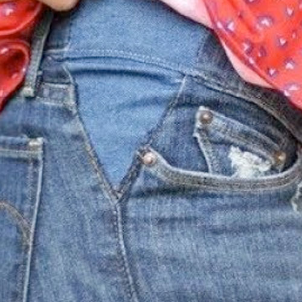
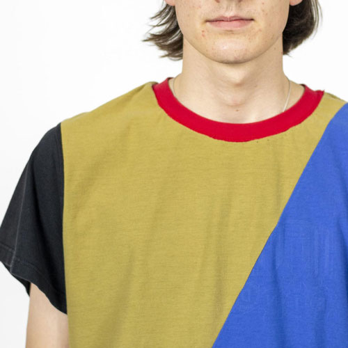
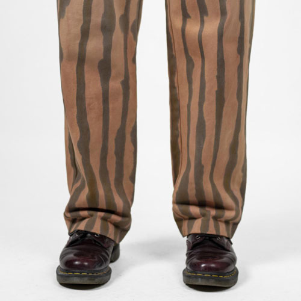
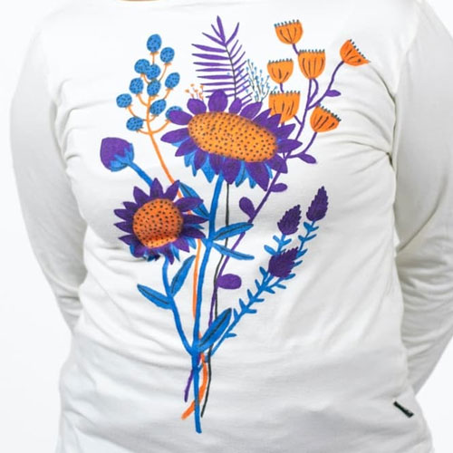

  <iframe width="800" height="400" src="https://www.youtube.com/embed/8wHs2IrIEMs" frameborder="0" allow="accelerometer; autoplay; encrypted-media; gyroscope; picture-in-picture" allowfullscreen></iframe>

Even after a lot of caring and repairing, sometimes your clothes just need an bigger upgrade.  It can be that there is too big of a stain rip in your clothes to either repair it or cover it up. Or it’s just not your style anymore. That you are at the verge of tossing it. But…..
We still see a stage before recycling or swapping. This stage can be used as a way of repairing as there are multiple possibilities in repairing and intentions of repairing. You can either return the clothes to its original identity or rework it in a way that changes its garment purpose and that last one is Upgrading. We are going to explain how to ‘Upgrade’ your clothing. The upgrade part is divided in 4 chapters;  Resize, Remake, Recolor and Decorate

# Techniques
| Upgrade|      Description    |
|--------------------|--------------------|
||    **Resize**     This is a very simple repair where you only use stitches to repair your rip. Don’t need much, but not super long lasting repair.      |
||    **Remake**   Similar to the stitch repair but here you add some extra fabric. This makes it very strong and durable but also quite visible.     |
||    **Recolor**   This is to cover edges from a broken area. Like the edges of a sleeve   |
||    **Decorate**   When you have a knitted sweater you can knit back the hole. You could make it almost invisible if you use the same yarn, or show of the repair with another color    |

#  Resize
A big one to know is changing the size of your garment and the length of it. If you know how to do this, you can even take over those pants that you never fitted from your mom or dad and actually wear them. So welcome to ‘Resizing’, the skill that makes everything wearable.

(📸Illustration of different ways to resize)

Resizing a garment can be understood in many ways; making it shorter, longer, smaller or bigger and then doing that visibly or invisible. Good ways to finish a garment when you make it shorter or longer, depends on what kind of clothing it is and what fabric it is made of. To find the right finish look in the Basics in the chapter Finishing.

#  Remake
Remake enables you to not throw away your garment fully when only one part is actually a reason to dispose. With Remake you can cut out the parts that you still like to use and can use, to eventually create one or two new garments out of a few garments that you would have thrown out.

A few things where you need to keep an eye on when you want to Remake
- It is easier to combine clothing from the same size. One size difference is still okay to work with.  But if you work for instance with an XS and XL, you need to think about the fit that is drastically going to change.
- Clothing preferably is a size bigger than you have yourself as you take out 0,5cm to 1cm at every seam you draw.  
- Always make sure to start pinning your new patterns from the top if one garment is longer than the other one.
- There are multiple varieties of combining clothing. The more complex your remake, the longer it takes to fully combine the garment and the smaller the shirt becomes.

(📸Illustration of different shirts combines)

A popular way to remake is combine 2 pieces of clothes together. However changing the function of a garment by adding something to it we also see that under Remake. Adding functionally can mean that you add something to the garment that has a function. That can be pockets, a pencil holder or a loop to hook your keys on like we did in the video.

#  Recolor

Sometimes in the laundry the colour, blacks or whites can fade out and lose its brightness or colour depth. As you may have read in the Care video this can be the result from mixing wrong colours together or simply by sweating and wearing it out, but if that doesn’t work anymore you can dye your clothing Chemically or Naturally. And both have them have up and downsides. It really depends on your needs where to go for

### Natural VS Chemical Dyeing

| Natural Dying | Chemical Dying |
|---------------|---------------|
|🟢 More ecological option  | 🔴 Consist of heavy toxic chemicals |
|🟢 Dye can be disposed in sink or on acid loving plants.| 🔴 Pollutes water.|
|🟢 Beautiful ancient craft|  🔴 Mwa..|
|🟢 Insane the colour plants and food waste can give.| 🔴 Usually made from oil|
|🟢 Friendly   | 🔴 Might cause skin irritation on sensitive skins |
|🔴 Takes way more time | 🟢 Fast and easy way   |
|🔴 Hard to replicate colors |  🟢 Stable outcome  |
|🔴 Quite experimental. | 🟢 Not much preparing needed, just go |
|🔴 Can only be done by hand | 🟢 Possible by hand and machine |
|🔴 Has no effects on Synthetic fibres | 🟢Tends to stick to more fibres |

As you can see both have their up and downsides. It depends up to your situation and time what makes most sense. The topi
Note: Never mix the tools you use for dyeing with cooking tools. Even when you use Natural Dye as the plants or pretreating ingredients can be toxic and may contain high amounts of metal and are harmful for the ingestion. So keep them separate.

### Overview of steps for Dyeing
You will find chemical dye works mostly for the washing machine.  We mainly advise to read the instructions on the package thoroughly to get the ultimate results. With Natural dying we demonstrate it briefly in the video, but it's quite a lot of steps. So below an overview. Let us know in Discord if you want an in depth video about this topic!

1. Find out the fibre of your clothes (Animal or plant based)
2. Choose a color that works on your Fibre( avocado, acorns, flowers, tumeric etc )
3. Scour your fabric (This cleans your fibres for better colors)
4. Mordant your fabric (This helps the dye bite into the fabric for a long-lasting colour. )
5. Prepare a dye vat (a place to soak and boil your clothes)
6. Color :)

(📸Show photo gallery of try out of Natural Dyeing)

We mainly dyed with Black Beans, Red Cabbage, Turmeric, Onion Skins (Yellow&Red), Nettle, Acorn, Camomille, Hibiscus, Coffee, Avocado (Skins and/or Nuts), Oxidized Copper, Pomegranate, Carrots and Beetroots.
All of them are favourites, besides Beetroot, Carrot, Nettle and Red cabbage as the dye molecules don't bind with the fabric even with a mordant...

#  Decorate
Decorating are smaller techniques or ways to adapt the look of the garment. You can apply these techniques as a way of repairing or covering a stain. All of them are a good way to extend the lifetime of your garment by personalizing the garment. Decorating can be:
- Color them with a new pattern
- Give them a drawing with textile markers
- Add embroidery
- Print something on top
- Use stitches to create a pattern
and much more

### A few decorative techniques we like

**Shibori & Tie Dye:** Next to using a full Dye, you can use your Dye for making prints. This can be done by using the dye options we showed you before, with Shibori techniques or Tie Dye techniques. Both techniques help you to give a print to your clothes.  Shibori is an ancient traditional Japanese technique created by folding and clamping two planks in any shape onto the folded fabric or garment. The way you fold it and the shape you clamp it with, creates different kinds of prints.
 And Tie tie derived from that in the US in the 60's. It is a more straightforward and simple technique of twisting and tying, which is more for a beginner.

**Bleach** Using bleach as a replacement for dye is great with techniques like Shibori and Tie-Dye. We know bleach is harmful for the environment, but throwing a garment still weighs heavier than bleach.  Besides this is the only way to give a faded dark coloured shirt a repurposed by changing in colour or print. For your Bleach dye, you will need ⅙ of bleach to ⅚ of water; we used 500 ml of bleach and 2,5l of water. This was enough to bleach jeans. Now there are ways to do it naturally with quite some sun and lemon. But this will take a lot of time as you need to leave it for months to see some result. Do always use gloves and wear an apron or work clothes, that you don’t mind to get stained

**Textile markers** This one is pretty straight forward. You can buy yourself some markers to draw on a shirt. Make sure to use real textile markers and not the normal ones for paper, because they fade out and might ruin your clothes. The outcome of this technique really depends on your drawing skills. Tip: If you are not very good bring them to a friends who is good in drawing, this will give a much better result!

**Printing**
A print on a garment doesn’t always need to be something what we call an all-over-print, but can also be an image or illustration placed on a specific place. This can be done with a Transfer paper or by Silkscreen Printing. Using placement printing can be used as a technique to cover up a stain.

Transfer printing is quite an easy way to do if you only need one garment printed. You can buy transfer papers and will only need a working printer. Follow the instructions on the package and iron the print of the garment.
Silkscreen printing requires more work upfront, but once you have it setup it’s much faster to run a production. For instance by covering up old shirts with new logo’s

**Embroidery**
Another way of decorating your garment is using Embroidery stitches, of course this can also be adapted over a rip or a stain and used as a way of repairing. With Embroidery you can literally create whatever you want in stitches and create 3D shapes by using wrap stitches and knot stitches. There is a wide variety of embroidery stitches by hand and by machine.
We like to use the chain stitch, as you can write your initials with it, or to decorate already existing top stitches in a coat for instance.
